# FortiGate Firewall Security, VPN, and Threat-Prevention Lab


> Project by Samuel Kim. All rights reserved. See [LICENSE](LICENSE).

## Overview

This project documents a FortiGate firewall lab focused on secure access, identity-aware policy design, VPN connectivity, internal service publishing, and threat-prevention profiles. The firewall is used as the central enforcement point between WAN, LAN, remote VPN users, and internal services.

The goal is to show how FortiGate features work together in a practical enterprise-style environment: administrator role-based access control, password hardening, LDAP integration, SSL VPN tunnel access, SSL VPN web portal access, Virtual IP publishing, site-to-site IPsec VPN, SSL/TLS inspection, web filtering, DNS filtering, antivirus inspection, intrusion prevention, application control, and quarantine.

From a cybersecurity perspective, the lab focuses on least privilege, controlled remote access, service-restricted firewall policy, encrypted traffic inspection, content filtering, malware prevention, botnet/C&C protection, and validation through client behavior and FortiGate logs.

## Objectives

- Define the FortiGate placement, interfaces, trusted networks, and external traffic path.
- Implement role-based administrative access with named accounts and restricted profiles.
- Apply a FortiGate password policy to local administrators and IPsec pre-shared keys.
- Integrate Active Directory identities through LDAP for group-based remote access.
- Configure and validate SSL VPN Tunnel Mode and browser-based Web Mode access.
- Publish an internal IIS service through destination NAT and a controlled inbound policy.
- Build a site-to-site IPsec VPN with directional service restrictions.
- Inspect encrypted and application traffic with FortiGate security profiles.
- Validate allowed and blocked behavior through client results, VPN status, and FortiGate logs.

## Project Roadmap

| Area | Implementation |
|------|----------------|
| Network foundation | FortiGate positioned between the WAN and two internal network segments |
| Administration | Named administrators, custom profiles, and read-only IT access |
| Identity and remote access | Active Directory LDAP integration, SSL VPN Tunnel Mode, and SSL VPN Web Mode |
| Service publishing | IIS portal exposed through a FortiGate Virtual IP and firewall policy |
| Site connectivity | IPsec VPN between New York and Tel Aviv with directional service restrictions |
| Traffic inspection | Full SSL/TLS inspection attached to outbound traffic |
| Threat prevention | Web Filter, DNS Filter, Antivirus, IPS, and Application Control profiles |

## Lab Environment

| Component | Role |
|-----------|------|
| FortiGate VM | Firewall, routing point, VPN gateway, destination NAT, and security inspection |
| Port 1 | WAN-facing interface connected to the external network |
| Port 2 | LAN-facing interface connected to the internal environment |
| AtlasAD | Active Directory and LDAP server; IIS is also installed here for the publishing exercise |
| Windows client | RDP destination and validation workstation |
| FortiClient VPN | Remote-access client used for SSL VPN Tunnel Mode |
| Envario | Virtual lab platform hosting the systems used in the exercise |

### Site addressing used by the IPsec exercise

| Site | Networks / endpoint |
|------|---------------------|
| New York | `10.90.1.0/24`, `10.90.11.0/24` |
| Tel Aviv | `10.74.1.0/24`, `10.74.11.0/24` |
| Tel Aviv WAN | `13.82.92.101` |

The public and private addresses above belong to the lab evidence and are retained to make the VPN design reproducible. They should not be reused as production addressing documentation.

## Tools and Technologies

- FortiGate / FortiOS web administration
- Active Directory Domain Services
- LDAP authentication
- SSL VPN Tunnel Mode and FortiClient
- SSL VPN Web Mode
- Remote Desktop Protocol (RDP)
- Internet Information Services (IIS)
- Destination NAT through a FortiGate Virtual IP
- Site-to-site IPsec VPN
- SSL/TLS inspection
- Web Filter, DNS Filter, Antivirus, IPS, and Application Control

## Implementation Walkthrough

The walkthrough is ordered by dependency. The firewall topology and access model come first, followed by VPN access, service publishing, site-to-site connectivity, and then layered security profiles. Each step explains what was configured, why it matters, and which screenshot validates the configuration or result.

---------

## Firewall Topology and Lab Planning

FortiGate is positioned between the external WAN and the internal LAN. In this lab, `Port1` represents the WAN-facing side and `Port2` represents the LAN-facing side. Internal systems include a Windows workstation and an AtlasAD domain server, while the firewall controls how those systems communicate with outside networks and remote users.

Planning this relationship first gives every later policy a clear direction. SSL VPN, Virtual IP publishing, IPsec selectors, and outbound inspection all depend on knowing which interface receives the traffic, which network contains the protected resource, and where the return traffic must travel.

> A firewall does not understand business intent automatically; it evaluates interfaces, addresses, services, identities, and policy order. A wrong WAN/LAN assumption can expose an internal service or block legitimate traffic, so the trust boundary must be defined before access and inspection rules are created.

**Implemented controls:**

- Defined the FortiGate placement between WAN and LAN.
- Identified the internal server and user workstation behind the firewall.
- Documented the interface direction used by VPN, destination NAT, and outbound inspection policies.

### Map the firewall traffic path

The logical topology maps the workstation, server, switching layer, FortiGate firewall, WAN interface, LAN interface, and internet path. `Port2` receives traffic from the protected internal side, while `Port1` carries traffic toward the external network. This is the baseline used to interpret every later firewall and VPN policy.

> FortiGate policies are directional. A policy from LAN to WAN does not automatically permit the reverse path, and an inbound service requires its own destination object and WAN-to-LAN rule. Mapping the traffic direction here prevents policy design from becoming guesswork later.


<p><sub><strong>Screenshot 002 - FortiGate Logical Topology:</strong> The firewall is positioned between the internal LAN and the external internet path.</sub></p>

### Identify the lab systems and network segments

The expanded topology shows the FortiGate VM connected to the Envario lab environment, with the Windows workstation and AtlasAD server placed on separate internal network ranges. These systems are used later as the remote-access destination, identity provider, IIS server, and client-side validation endpoint.

> A clear role plan links each device to its security function. AtlasAD provides directory identities and an internal service, the workstation represents the user endpoint, and FortiGate enforces the traffic between them. VPN, LDAP, RDP, and filtering tests are easier to understand once those responsibilities are explicit.


<p><sub><strong>Screenshot 003 - Lab Network Overview:</strong> The FortiGate VM, WAN path, internal server, client, and lab network segments are shown together.</sub></p>

### Understand the platform role

FortiGate is a network security platform that combines stateful firewalling with VPN, identity integration, content inspection, application awareness, and threat prevention. In this project, these capabilities are not treated as isolated menu options: they are attached to traffic paths and user groups so the firewall can make decisions based on source, destination, service, identity, and detected content.

> Stateful inspection means the firewall tracks the context of a connection and allows valid return traffic for an accepted session. The additional security profiles then examine that permitted session for unsafe websites, domains, files, attacks, or applications instead of replacing the underlying firewall decision.

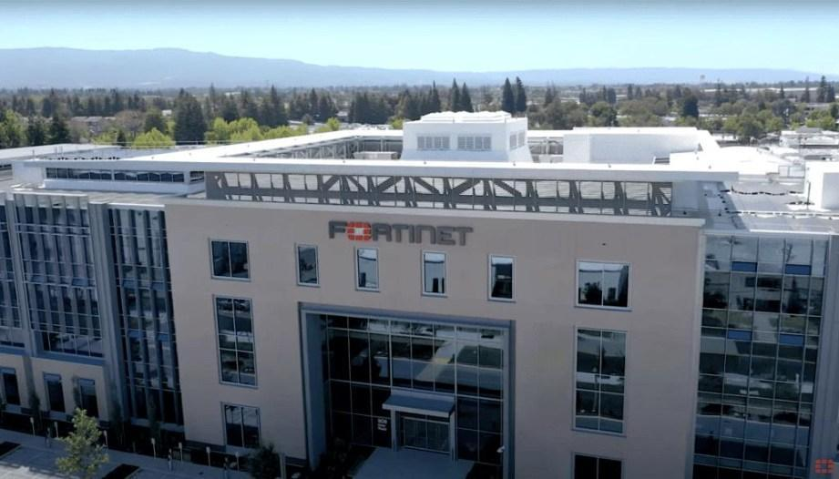

<p><sub><strong>Screenshot 004 - Fortinet Platform Context:</strong> Fortinet headquarters accompanies the introduction to the vendor behind the FortiGate platform.</sub></p>

---------

## Administrator Access and Role-Based Control

Administrative access is separated into named profiles instead of giving every operator unrestricted `super_admin` privileges. One profile demonstrates a powerful but selectively restricted administrator, while the IT profile provides view-only access to the operational areas required for monitoring and support.

This design makes the administrative plane part of the security architecture. Firewall rules protect network traffic, but administrator profiles protect the configuration itself by controlling who can change policies, security profiles, interfaces, and logs.

> Role-based access control reduces the impact of account compromise and human error. An operator who only needs to review policies or logs should not automatically be able to alter VPN settings, disable protection, or create new administrators.

**Implemented controls:**

- Created a restricted Super_Admin-like profile.
- Assigned a named administrator to the custom profile.
- Created an IT read-only profile and three administrator accounts.
- Validated the menus and permissions visible to restricted sessions.

### Create a restricted administrator profile

A custom profile named `Special_Admin_Profile` is created under the FortiGate administrator-profile settings. It keeps broad access where administration is required, changes Log & Report to read-only, and hides or restricts selected areas such as System and Security Profiles. This produces a controlled alternative to assigning unrestricted `super_admin` rights.

> An administrator profile defines capability, while the administrator account defines identity. Keeping those objects separate allows the same permission design to be reviewed and reused without turning multiple operators into shared or anonymous super administrators.


<p><sub><strong>Screenshot 005 - Restricted Administrator Profile:</strong> The custom profile is created with selected read, read-write, and hidden access permissions.</sub></p>

### Create a named administrator account

The named account `Special_Admin` is created and assigned to `Special_Admin_Profile`. The account inherits the profile's permission boundaries when it signs in, so the restriction is enforced by FortiGate rather than relying on the operator to avoid sensitive menus.

> Named administrative accounts improve accountability because configuration changes and login events can be associated with a specific identity. Shared accounts weaken auditing and make it harder to determine who performed a risky change.


<p><sub><strong>Screenshot 006 - Named Administrator Account:</strong> `Special_Admin` is assigned to `Special_Admin_Profile` during account creation.</sub></p>

### Review the restricted administrator interface

After signing in with `Special_Admin`, several parts of the interface are reviewed. The screenshots show the active username, the reduced navigation, and the limited System and Security Profiles views. This confirms that the profile is actually applied to the session instead of existing only as an unused configuration object.

> Permission validation should be performed from the restricted account itself. Reviewing the profile as a super administrator proves how it was configured, but logging in as the delegated account proves what that operator can really see and use.

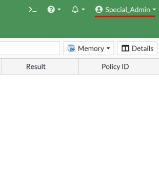

<p><sub><strong>Screenshot 007 - Special Administrator Session:</strong> The header identifies the active `Special_Admin` account used to validate the delegated profile.</sub></p>

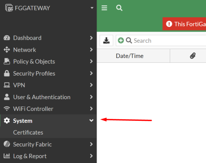

<p><sub><strong>Screenshot 008 - Restricted System Menu:</strong> The limited session can open the approved System area while unavailable functions remain outside the delegated profile.</sub></p>


<p><sub><strong>Screenshot 009 - Restricted Security Profiles Menu:</strong> The delegated account sees only the permitted SSL/SSH Inspection entry under Security Profiles.</sub></p>

### Create a new IT administrator group and profile

The IT team is represented by an `IT_Group` administrator profile. Its permissions are limited to viewing operational areas such as firewall policies, logs, Virtual IPs, and interfaces. The profile centralizes this permission model so every assigned IT administrator receives the same controlled view.

> Read-only access supports troubleshooting without granting change authority. An IT operator can inspect the active configuration and logs, but sensitive modifications remain reserved for a more privileged administrative role.


<p><sub><strong>Screenshot 010 - IT Read-Only Profile:</strong> The `IT_Group` profile is configured with view-only access to the required operational sections.</sub></p>

### Create three IT administrators

Three named administrator accounts are created and assigned to `IT_Group`. Reusing one profile keeps the access model consistent across the team and makes later permission changes easier because the profile can be adjusted once instead of editing every account separately.

> Grouping administrators by job function is easier to audit than maintaining unrelated per-user permission sets. It also reduces configuration drift when several operators are expected to perform the same support duties.


<p><sub><strong>Screenshot 011 - IT Administrator Membership:</strong> Three IT administrator accounts are listed with the shared `IT_Group` profile.</sub></p>

### Validate read-only IT access

An IT administrator session is opened to verify the final result. Only the approved operational sections are available, and the interface shows that the account can review information without receiving unrestricted configuration rights.

> Least privilege is demonstrated by both access and restriction: the administrator must be able to reach the required monitoring views while remaining unable to modify unrelated security controls. A limited menu alone is not enough unless the available pages also enforce read-only behavior.


<p><sub><strong>Screenshot 012 - IT Navigation Restrictions:</strong> The limited menu shows which operational areas remain available to the IT administrator.</sub></p>


<p><sub><strong>Screenshot 013 - Read-Only IT Session:</strong> The restricted interface confirms that the IT account can view approved information without unrestricted write access.</sub></p>

---------

## FortiGate Password Policy Hardening

Password controls reduce the chance that locally managed FortiGate credentials or IPsec pre-shared keys can be guessed through dictionary, brute-force, or weak-password attacks. The configured policy requires at least eight characters and a mixture of uppercase letters, lowercase letters, numbers, and special symbols.

The selected scope is `Both`. On FortiGate, this applies to locally defined administrator passwords and IPsec VPN pre-shared keys; it does not replace the Active Directory password policy for LDAP users. Eight characters are suitable for demonstrating the control in a lab, while production environments should prefer longer passwords or passphrases and multi-factor authentication.

> Password policy scope is important because FortiGate cannot impose this local setting on credentials stored in Active Directory. LDAP users remain governed by the domain's account policy, while this FortiGate control protects the local administrative and IPsec secrets managed on the firewall.

**Implemented controls:**

- Enabled the FortiGate password policy.
- Applied the policy to administrator passwords and IPsec pre-shared keys.
- Required multiple character classes to reduce predictable password choices.
- Documented the stronger password and MFA expectations for production use.

### Configure the password policy

The password-policy page is opened under the FortiGate system settings and the scope is set to `Both`. The minimum length and character requirements are then configured so newly accepted local administrator passwords and IPsec pre-shared keys must satisfy the defined baseline.

> Complexity requirements make simple guessing attacks more expensive, but they do not compensate for reused credentials or a compromised administrator session. Production protection should combine long unique secrets with MFA, restricted management access, monitoring, and timely credential rotation.


<p><sub><strong>Screenshot 014 - Password Complexity Policy:</strong> FortiGate enforces the configured length and character requirements for both administrator passwords and IPsec pre-shared keys.</sub></p>

---------

## LDAP Integration and SSL VPN Tunnel Mode

SSL VPN Tunnel Mode gives a remote computer a protected network path into selected internal resources through FortiClient. Active Directory remains the identity authority, LDAP allows FortiGate to verify those directory users, and a FortiGate user group converts the directory membership into an object that VPN authentication and firewall policies can reference.

The access path is built in layers: prepare the directory group, connect FortiGate to LDAP, import the identities, create the tunnel portal, map the group to that portal, permit only RDP to the workstation, and then validate the complete session from FortiClient. Each layer has a different purpose, so a successful LDAP test alone does not mean the VPN or RDP access is ready.

> Remote access is safest when identity, network assignment, routing, and application permission are controlled separately. Authentication answers who the user is, the portal defines the tunnel behavior, and the firewall policy decides which internal service that authenticated user may actually reach.

**Implemented controls:**

- Created an Active Directory group for Sales VPN users.
- Connected FortiGate to AtlasAD through LDAP.
- Imported directory identities and mapped them to a FortiGate group.
- Configured split-tunnel SSL VPN access and an address pool.
- Restricted the tunnel-to-LAN policy to the internal RDP destination.
- Validated FortiClient authentication, tunnel establishment, and RDP access.

### Prepare the LDAP Sales group in Active Directory

The `LDAP_Sales` security group and three users are created on AtlasAD before FortiGate is configured. This makes the directory group the central membership list for Sales remote access instead of maintaining a separate set of individual usernames inside the firewall.

> Group-based authorization separates identity administration from firewall administration. A directory administrator can add or remove a Sales user from the approved group, while the FortiGate policies continue to reference one stable group object.


<p><sub><strong>Screenshot 015 - LDAP Sales Group:</strong> Three Active Directory users are shown as members of the `LDAP_Sales` group.</sub></p>

### Connect FortiGate to Active Directory

An LDAP server object is created with the AtlasAD address, port, domain components, and bind identity. FortiGate uses this object to locate the directory, authenticate the bind account, search for users and groups, and later verify VPN credentials. The successful connectivity test confirms that the firewall can query AtlasAD using the entered settings.

The lab uses regular LDAP on port `389` with secure connection disabled. This preserves the implemented configuration, but production deployments should use LDAPS or StartTLS with a trusted certificate and a dedicated least-privileged bind account rather than a general server administrator identity.

> LDAP is the query and authentication protocol; it is not the VPN tunnel itself. In this lab the directory connection is unencrypted, which is acceptable only for controlled demonstration. Production LDAP traffic can contain sensitive identity information and should be protected against interception.


<p><sub><strong>Screenshot 016 - FortiGate LDAP Connection:</strong> The AtlasAD LDAP object contains the server, bind, and directory settings and reports a successful connection.</sub></p>

### Start the remote-user import

FortiGate is instructed to create remote LDAP users instead of local firewall users. The remote-user wizard is opened, the LDAP user type is selected, and AtlasAD is chosen as the directory source. This keeps the passwords in Active Directory while making the required identities visible to FortiGate policy objects.

> A remote user object does not copy the user's password into FortiGate. The firewall keeps a reference to the external identity source and asks LDAP to validate the credentials when the user authenticates.


<p><sub><strong>Screenshot 017 - Remote LDAP User Selection:</strong> The user creation wizard is set to import remote LDAP identities.</sub></p>


<p><sub><strong>Screenshot 018 - LDAP Directory Selection:</strong> The configured AtlasAD LDAP server is selected as the source for imported users.</sub></p>


<p><sub><strong>Screenshot 020 - Imported LDAP Identities:</strong> The selected directory accounts appear in the FortiGate user definitions.</sub></p>

### Select and verify the LDAP users

The required Sales accounts are selected from the LDAP directory and then reviewed in FortiGate's user list. At this point the firewall has the identity objects needed for group membership, but the users still do not have VPN access until the portal mapping and traffic policy are configured.

> Identity visibility and authorization are different stages. Seeing a user in FortiGate proves that the directory object can be selected; it does not prove that the user is allowed to establish a tunnel or reach an internal system.


<p><sub><strong>Screenshot 019 - Active Directory User Selection:</strong> The Sales users are selected from the LDAP directory for import into FortiGate.</sub></p>

### Configure the Tunnel Mode portal

The SSL VPN portal is configured for Tunnel Mode with split tunneling. The VPN address pool supplies an internal tunnel address to each connected client, while the routing address identifies the protected network that FortiClient should send through the tunnel. The saved portal then becomes a reusable set of connection settings assigned to authorized users.

Split tunneling sends only traffic for approved internal networks through FortiGate. Other internet traffic continues through the user's normal connection, reducing unnecessary bandwidth consumption while still protecting access to company resources.

> The portal defines how the client connects, not whether the destination is allowed. Even when FortiClient learns a route to the internal network, the traffic must still match a firewall policy before FortiGate forwards it to the LAN.


<p><sub><strong>Screenshot 021 - Tunnel Portal Configuration:</strong> Tunnel Mode, split tunneling, and the client address pool are configured for remote users.</sub></p>

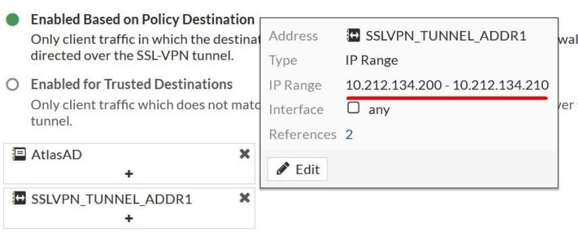

<p><sub><strong>Screenshot 022 - Split-Tunnel Destination:</strong> The internal routing address and VPN client pool are selected for the tunnel portal.</sub></p>


<p><sub><strong>Screenshot 023 - Completed Tunnel Portal:</strong> The new SSL VPN portal appears in the portal list after its settings are saved.</sub></p>

### Create the FortiGate LDAP user group

The imported Active Directory group is associated with a FortiGate user group. This object bridges external LDAP membership with FortiGate authentication rules, allowing the same directory-managed Sales group to be referenced by the SSL VPN mapping and traffic policy.

> FortiGate user groups are policy objects, while the actual member list remains in Active Directory. This arrangement keeps access decisions identity-aware without forcing the firewall administrator to recreate the directory structure manually.

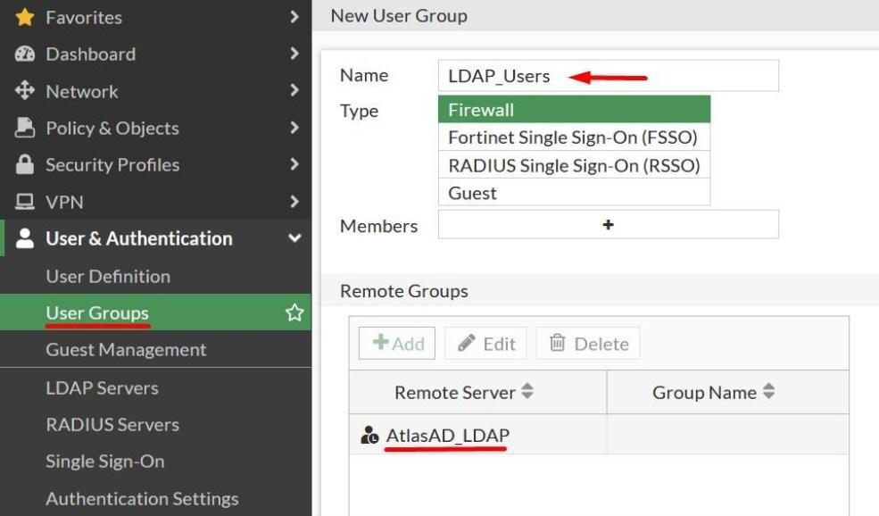

<p><sub><strong>Screenshot 025 - LDAP Group Mapping:</strong> The `LDAP_Users` FortiGate group is associated with the remote AtlasAD LDAP source.</sub></p>

### Configure SSL VPN listening settings

SSL VPN is bound to the WAN interface and port `443`, which defines where remote FortiClient connections arrive. The built-in `Fortinet_Factory` certificate is selected for this isolated exercise so the firewall can present a server certificate during the TLS handshake. The listener and certificate settings are applied before the user-to-portal mapping is tested.

> The factory certificate can encrypt a lab connection, but it does not prove the identity of a production VPN service to external users. A public deployment should use a trusted certificate matching the VPN FQDN and should normally combine directory credentials with MFA.


<p><sub><strong>Screenshot 024 - SSL VPN Listener and Certificate:</strong> The WAN interface, HTTPS port, and laboratory server certificate are selected for SSL VPN access.</sub></p>

### Map LDAP users to the tunnel portal

Authentication and portal mapping connects the LDAP group to the Tunnel Mode portal. When a remote user authenticates successfully and belongs to the approved group, FortiGate selects this rule and returns the address-pool, routing, and split-tunneling behavior configured in the portal.

> Portal mapping is the decision point between identity and connection behavior. Without a matching rule, valid LDAP credentials may still receive the wrong portal or no usable remote-access configuration.


<p><sub><strong>Screenshot 026 - SSL VPN Mapping Overview:</strong> The authentication table shows `LDAP_Users` mapped to the Tunnel Mode portal and provides the control used to create a new mapping.</sub></p>

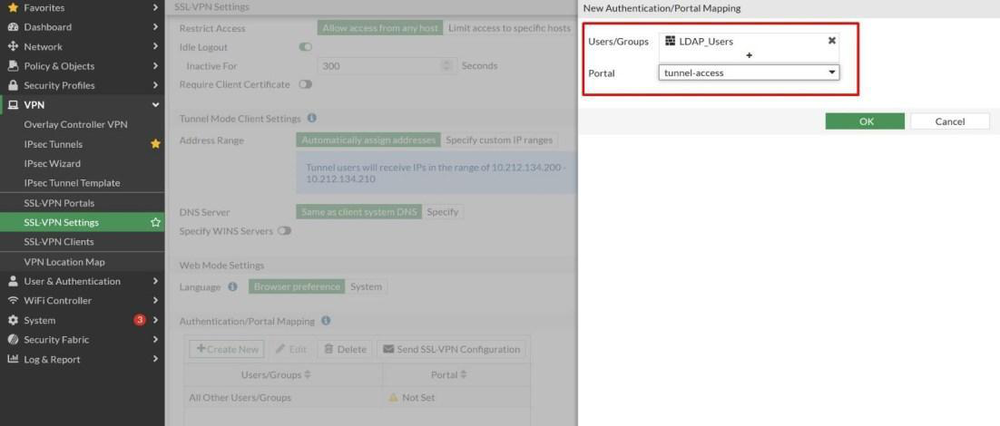

<p><sub><strong>Screenshot 027 - Tunnel Portal Mapping Details:</strong> The authentication rule associates the `LDAP_Users` group with the configured `tunnel-access` portal.</sub></p>

### Allow RDP from the VPN to the workstation

The firewall policy accepts traffic from the SSL VPN tunnel interface toward the LAN workstation and limits the service to RDP. Its source includes the approved VPN identities and tunnel address range, while the destination identifies the internal computer. This converts an authenticated tunnel into a narrowly defined application path rather than general LAN access.

> A VPN should not automatically create full trust. Restricting the policy to the required destination and RDP service reduces lateral movement opportunities if a remote credential or endpoint is compromised.


<p><sub><strong>Screenshot 028 - SSL VPN RDP Policy:</strong> The tunnel-to-LAN policy allows authenticated LDAP VPN users to reach the internal workstation with RDP.</sub></p>

### Configure FortiClient on the remote computer

FortiClient is installed on the external computer and a connection profile is created with the FortiGate WAN gateway and HTTPS port. The profile tells the client where the VPN listener is located; the user then selects that profile and enters an Active Directory username and password for LDAP validation.

> FortiClient is the endpoint component that creates the encrypted tunnel and installs the assigned route on the remote computer. The client configuration must match the FortiGate listener, otherwise the request never reaches the authentication and portal rules.


<p><sub><strong>Screenshot 030 - FortiClient LDAP Authentication:</strong> An Active Directory user signs in to the newly configured VPN connection.</sub></p>

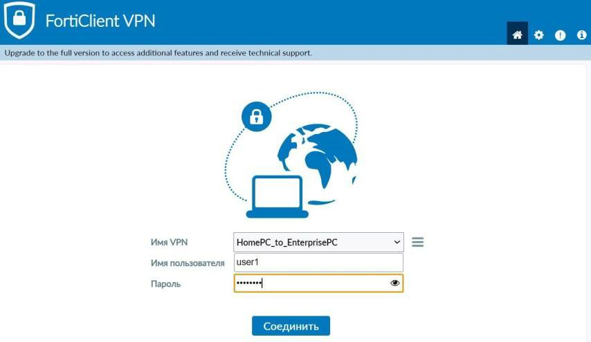

<p><sub><strong>Screenshot 029 - FortiClient VPN Profile:</strong> The remote FortiGate gateway and SSL VPN connection settings are entered in FortiClient.</sub></p>

### Validate the tunnel and RDP session

FortiClient shows an active tunnel and an assigned VPN address, proving that the user authenticated and received the Tunnel Mode portal settings. The Windows desktop then opens through RDP, confirming the rest of the path: split-tunnel routing, SSL VPN interface processing, firewall policy matching, LAN reachability, and the RDP service on the target workstation.

> End-to-end validation is stronger than a green VPN status alone. A connected tunnel proves remote access was established, while the successful RDP session proves that the intended internal application can actually be reached through the restricted policy.


<p><sub><strong>Screenshot 031 - Active FortiClient Tunnel:</strong> FortiClient reports a connected SSL VPN session and assigned tunnel address.</sub></p>


<p><sub><strong>Screenshot 032 - RDP Through SSL VPN:</strong> The remote user reaches the internal Windows workstation through the encrypted VPN tunnel.</sub></p>

### Understand how RDP and VPN work together

RDP is Microsoft's remote-display protocol and normally uses TCP port `3389`. It carries the graphical desktop from the remote Windows system to the client and returns keyboard and mouse input to the remote host. The VPN does not replace RDP; it creates the protected network path that allows the RDP session to reach an internal address without exposing the workstation directly to the public internet.

> Publishing RDP directly to the internet would expose the service to scanning and credential attacks. Placing RDP behind authenticated VPN access adds an encrypted and identity-controlled entry point before the workstation becomes reachable.

---------

## SSL VPN Web Mode

SSL VPN Web Mode provides browser-based access to selected internal services without giving the endpoint a general routed tunnel. In this exercise, LDAP-authenticated HR users sign in to the FortiGate portal and receive an RDP bookmark that represents one approved internal workstation.

The workflow deliberately repeats some identity steps from Tunnel Mode because HR access is kept separate from Sales access. A distinct Active Directory group, FortiGate user group, portal mapping, bookmark, and firewall policy make it possible to change one remote-access use case without affecting the other.

> Tunnel Mode extends selected network routes to FortiClient, while Web Mode publishes individual resources through the browser portal. Web Mode can reduce exposure when a user needs one defined application rather than broader network-level access.

**Implemented controls:**

- Created a dedicated LDAP group for HR remote users.
- Enabled Web Mode and created an internal RDP bookmark.
- Mapped the HR group to the browser portal.
- Created the SSL VPN-to-LAN policy for the published workstation.
- Validated portal authentication and browser-based RDP access.

### Create the LDAP HR group and users

The `LDAP_HR` group and three directory users are prepared in Active Directory. A separate group keeps the HR Web Mode use case independent from the Sales Tunnel Mode configuration and allows FortiGate to apply a different portal and access policy.

> Department groups are useful security boundaries only when the firewall policies continue to reference them separately. Reusing one broad remote-access group would make it harder to limit each department to its intended resources.


<p><sub><strong>Screenshot 033 - LDAP HR Group:</strong> Three HR users are shown as members of the Active Directory `LDAP_HR` group.</sub></p>

### Enable Web Mode on the portal

The SSL VPN portal is configured for Web Mode. Instead of receiving tunnel routes and a client address, the authenticated user interacts with resources explicitly published as portal bookmarks. This narrows the remote-access experience to the services selected by the administrator.

> A portal is a presentation and connection profile. It does not bypass firewall policy, so the bookmarked destination must still be allowed from the SSL VPN interface to the internal network.


<p><sub><strong>Screenshot 034 - Web Mode Portal:</strong> Web Mode is enabled in the SSL VPN portal configuration.</sub></p>

### Create the RDP bookmark

An RDP bookmark stores the internal workstation address, TCP port `3389`, and connection security settings. The bookmark gives the HR user a named launch point in the portal and prevents the user from choosing arbitrary internal targets through the interface.

> The bookmark describes the application destination, while the firewall policy enforces the network permission. Both layers must agree; a visible bookmark without a matching policy will fail, and an overly broad policy could allow more access than the bookmark suggests.


<p><sub><strong>Screenshot 035 - RDP Web Bookmark:</strong> The internal workstation is published as an RDP bookmark inside the SSL VPN portal.</sub></p>
### Import and group the HR identities

The `LDAP_HR` object referenced by the portal mapping is backed by the AtlasAD LDAP source. Documenting the group association shows that FortiGate uses a directory-managed identity set rather than maintaining separate local VPN passwords.

> Keeping HR membership in the directory allows access to follow normal account administration. Removing a user from the approved LDAP group should remove the identity match without editing every VPN rule individually.

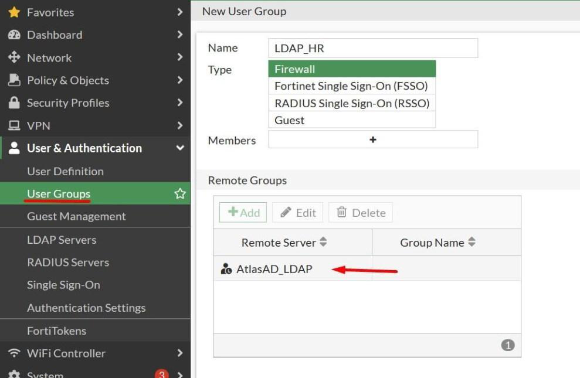

<p><sub><strong>Screenshot 037 - FortiGate HR User Group:</strong> The FortiGate `LDAP_HR` group references AtlasAD as its remote identity source.</sub></p>

### Map HR users to the web portal

The existing HR directory-backed group is mapped to the Web Mode portal under the SSL VPN authentication rules. After LDAP validates the credentials, FortiGate evaluates group membership and delivers the portal containing the RDP bookmark to matching HR users.

> Authentication proves the credentials, but authorization decides which portal the identity receives. This separation allows two valid domain users to receive different remote-access capabilities based on group membership.

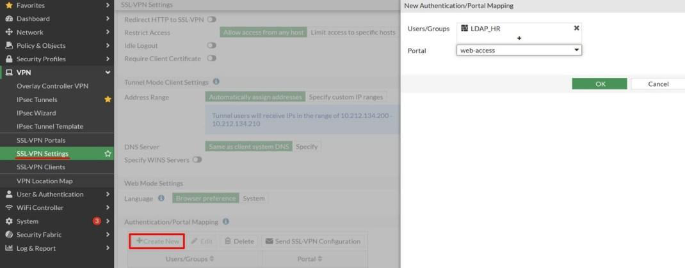

<p><sub><strong>Screenshot 036 - HR Portal Mapping:</strong> The `LDAP_HR` group is directed to the configured `web-access` SSL VPN portal.</sub></p>

### Create the Web Mode firewall policy

The firewall policy accepts traffic from the SSL VPN interface toward the internal workstation. The source is limited to the HR user group, and the destination is the workstation represented by the RDP bookmark. NAT is not required for this internal path because FortiGate routes between the SSL VPN context and the LAN.

> An authenticated portal session does not authorize all internal traffic. The policy is the enforcement point that permits the approved Web Mode flow and keeps unrelated LAN resources outside the HR access path.


<p><sub><strong>Screenshot 038 - Web Mode Access Policy:</strong> SSL VPN Web Mode users are allowed to reach the internal workstation through the LAN interface.</sub></p>

### Validate browser authentication and RDP

An HR user opens the FortiGate HTTPS portal and signs in with directory credentials. The authenticated portal displays the published RDP resource, and launching it opens the remote Windows desktop. The three screens document identity verification, resource presentation, and application access in the same order the user experiences them.

> This result validates more than the login page. It shows that LDAP authentication, group mapping, portal selection, the RDP bookmark, firewall policy, and internal service path work together end to end.


<p><sub><strong>Screenshot 039 - SSL VPN Portal Login:</strong> The browser requests LDAP user credentials for the FortiGate web portal.</sub></p>

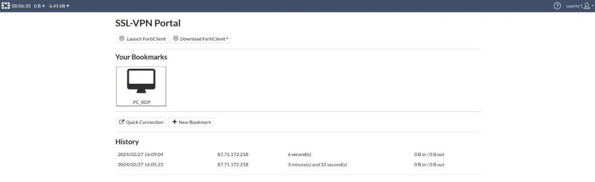

<p><sub><strong>Screenshot 040 - Authenticated Web Portal:</strong> The logged-in HR user sees the published remote-access resource.</sub></p>


<p><sub><strong>Screenshot 041 - Browser-Based RDP Session:</strong> The internal Windows desktop opens through the FortiGate SSL VPN web portal.</sub></p>

---------

## IIS Publishing with Destination NAT

The internal IIS portal is published through a FortiGate Virtual IP. In this design, the VIP performs **destination NAT**: traffic sent to the external address is translated and forwarded to the private address of the IIS server. The Virtual IP defines the address translation, while a separate WAN-to-LAN firewall policy decides whether the inbound service is allowed.

The server is tested locally before the firewall objects are created. This separates application troubleshooting from firewall troubleshooting: if IIS does not respond on the server itself, changing the VIP or policy cannot make the website work externally.

> A FortiGate VIP is not automatically a load balancer. This exercise maps an external address to one internal server through destination NAT. FortiGate virtual-server load balancing is a separate configuration used when traffic must be distributed across multiple backend servers.

**Implemented controls:**

- Installed and locally validated the IIS web service.
- Created a Virtual IP mapping from the WAN address to AtlasAD.
- Created an inbound firewall policy referencing the VIP.
- Validated the IIS portal through the FortiGate external address.
- Documented service minimization and production role-separation requirements.

### Install IIS on the Atlas server

The Web Server (IIS) role is installed on AtlasAD to provide an internal website for the publishing exercise. Installing the role creates the web-service components that will listen for HTTP requests before FortiGate redirects external traffic to the server.

> Combining IIS and Active Directory is acceptable for an isolated lab with limited resources, but the roles should be separated in production. A public-facing web-service vulnerability should not place domain-controller credentials, directory data, and authentication services on the same host at risk.


<p><sub><strong>Screenshot 042 - IIS Role Installation:</strong> The Web Server role is selected on the internal Atlas Windows server.</sub></p>

### Understand and use the loopback address

The default IIS page is opened through `127.0.0.1` on the Atlas server. The IPv4 loopback address sends the request back to the same host without using the physical LAN, so a successful page proves that the IIS service is installed, listening, and able to return content locally.

> Loopback testing isolates the application from the network path. It is a necessary first check, but it does not validate the server's LAN address, the FortiGate destination translation, the inbound policy, or external reachability.


<p><sub><strong>Screenshot 043 - Local IIS Validation:</strong> The IIS default page responds on the server's loopback address.</sub></p>

### Create the Virtual IP object

The Virtual IP object maps the FortiGate WAN address to the private Atlas server address. When inbound traffic targets the external address, FortiGate can replace the packet's destination with the mapped internal address and forward it toward the LAN server.

> A VIP defines how the destination address should be translated; it does not independently permit traffic. FortiGate still requires a matching firewall policy so the administrator can control source, interface, schedule, and service.


<p><sub><strong>Screenshot 044 - Destination NAT Object:</strong> The Virtual IP maps external traffic to the internal IIS server.</sub></p>

### Permit inbound web traffic

A WAN-to-LAN policy uses the website VIP as its destination and allows the configured Web Access service group. This rule provides the missing authorization layer between the address translation and the internal IIS server, allowing inbound traffic to traverse `Port1` and reach the LAN.

> The laboratory service group includes HTTP, HTTPS, and DNS, but DNS is not required merely to publish IIS. A production rule should permit only the protocols actually hosted by the server, normally HTTP and/or HTTPS, and should restrict source addresses where practical.


<p><sub><strong>Screenshot 045 - Inbound Web Policy:</strong> The WAN-to-LAN rule references the website VIP and permits the configured web-access services.</sub></p>

### Validate the published portal externally

The IIS page is opened from outside the server by using the FortiGate external address. The successful response confirms the complete publishing path: the request reaches the WAN interface, matches the inbound policy, is translated by the VIP, arrives at IIS, and returns through the firewall to the client.

> External validation is what proves the firewall publishing configuration. The earlier loopback result verified IIS locally; this result adds the network interfaces, destination NAT, policy evaluation, routing, and return path.


<p><sub><strong>Screenshot 046 - External IIS Access:</strong> The internal IIS portal is reachable through the FortiGate WAN address and destination NAT configuration.</sub></p>

---------

## Site-to-Site IPsec VPN

IPsec protects traffic between the New York and Tel Aviv private networks across an untrusted external path. Each FortiGate acts as a VPN peer: the devices authenticate one another, negotiate cryptographic parameters, and create an encrypted path for traffic that matches the defined private-network selectors.

The tunnel itself does not grant unlimited trust between the locations. Directional firewall policies are edited after tunnel creation so New York can test Tel Aviv with ping, while the reverse direction is intended to allow only RDP toward the New York systems.

> IPsec protects confidentiality and integrity while traffic crosses the public network, but firewall policy still controls what the connected sites may do. Treating a VPN as unrestricted LAN extension would allow a compromise at one site to spread more easily to the other.

**Implemented controls:**

- Created a FortiGate-to-FortiGate site-to-site tunnel.
- Configured the remote WAN gateway, outgoing interface, and PSK.
- Defined the New York and Tel Aviv protected networks.
- Reviewed the negotiated tunnel state.
- Applied directional ping and RDP service requirements.
- Tested allowed and denied behavior from both sides.

### Start the FortiGate-to-FortiGate tunnel

The IPsec wizard is opened and the FortiGate-to-FortiGate site-to-site option is selected. This tells FortiOS that both endpoints are compatible firewall peers and prepares the Phase 1, Phase 2, routing, and policy objects required for the connection.

> Phase 1 establishes and authenticates the secure control channel between the peers. Phase 2 negotiates the IPsec security associations that protect the selected network traffic carried through the tunnel.


<p><sub><strong>Screenshot 047 - Site-to-Site IPsec Wizard:</strong> A FortiGate-to-FortiGate VPN is selected for the two-site connection.</sub></p>

### Configure the remote gateway and PSK

The Tel Aviv WAN address `13.82.92.101` is entered as the remote gateway, `Port1` is selected as the outgoing interface, and both peers are configured with the same pre-shared key. These values allow the New York FortiGate to locate the correct remote peer and prove possession of the shared secret during negotiation.

> A PSK is a shared authentication secret, not an encryption algorithm. In production it should be long, randomly generated, stored securely, and rotated according to policy because disclosure would weaken peer authentication.


<p><sub><strong>Screenshot 048 - IPsec Peer and PSK Settings:</strong> The remote FortiGate WAN address, outgoing interface, and pre-shared key are configured.</sub></p>

### Define the protected networks

The New York networks `10.90.1.0/24` and `10.90.11.0/24` are paired with the Tel Aviv networks `10.74.1.0/24` and `10.74.11.0/24`. These local and remote selectors identify the private address ranges that the peers should protect and ensure unrelated internet traffic does not enter this site-to-site tunnel.

> The selectors must be mirrored correctly on both FortiGate devices. If one peer defines different local or remote subnets, Phase 1 may succeed while Phase 2 or actual data traffic still fails.

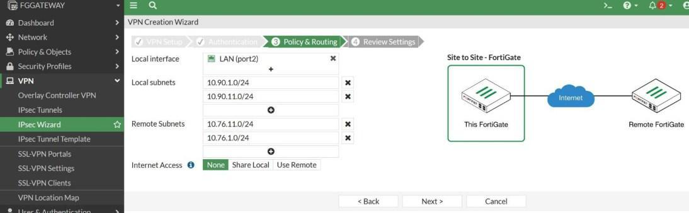

<p><sub><strong>Screenshot 049 - IPsec Network Selectors:</strong> The New York and Tel Aviv private subnets are entered as the local and remote protected networks.</sub></p>

### Confirm the tunnel state

After both peers complete their configuration, the IPsec monitor is opened to review the tunnel and Phase 2 state. An established tunnel confirms that the public endpoints can reach each other and agree on the authentication, encryption, and protected-network parameters.

> Tunnel status proves successful negotiation, not application permission. Cross-site ping or RDP can still fail because of firewall policy, routing, host firewalls, or an unavailable destination service.


<p><sub><strong>Screenshot 050 - IPsec Tunnel Monitor:</strong> The site-to-site VPN appears in the FortiGate monitor with its negotiated tunnel state.</sub></p>

### Limit New York-to-Tel Aviv traffic to ping

The New York-to-Tel Aviv policy is restricted to the `PING` service. ICMP echo traffic can therefore be used to verify basic cross-site reachability without granting general application access from New York into the Tel Aviv networks.

> Service restriction demonstrates least privilege between connected sites. The encrypted tunnel provides transport, while this directional policy limits the permitted use of that transport to the specific test required by the lab.


<p><sub><strong>Screenshot 051 - New York to Tel Aviv Ping Policy:</strong> The directional IPsec policy explicitly allows the PING service.</sub></p>

### Review the Tel Aviv-to-New York RDP rule

The reverse policy is intended to permit Tel Aviv users to reach New York systems only with RDP. The service-selection pane shows `RDP`, but the saved Service field in the same screenshot still displays `ALL`. The evidence therefore records the intended selection and the configuration issue that remains visible in the policy field.

> For the least-privilege design to be complete, the saved service must be changed from `ALL` to `RDP` and validated again. Leaving `ALL` would allow any service accepted by the destination host, which is broader than the stated remote-administration requirement.


<p><sub><strong>Screenshot 052 - Tel Aviv to New York RDP Rule:</strong> RDP is selected in the service picker, while the policy field still shows `ALL` and therefore requires a final correction.</sub></p>

### Validate cross-site access

The two sides test the intended services after the tunnel is established. The combined validation screen records command-line reachability and an RDP connection attempt across the VPN, connecting the negotiated tunnel state with actual host-to-host traffic.

> Testing both the tunnel and the application separates cryptographic success from policy success. A VPN can be up while traffic is still blocked, so the final check must use the same source, destination, and service described by the rule.


<p><sub><strong>Screenshot 053 - Cross-Site Service Validation:</strong> Command-line and RDP tests are performed after the IPsec policies are applied.</sub></p>

### Compare validation from the remote site

The remote-side screenshots provide the opposite perspective of the same VPN. The RDP client is opened toward the permitted destination, while ping fails in the direction where ICMP is not allowed. Together these results show that the tunnel carries traffic in both directions but the intended services are evaluated directionally.

> A denied test is valuable evidence when denial is the expected policy result. The failed reverse ping demonstrates that encrypted connectivity does not automatically override the service restriction configured for that direction.


<p><sub><strong>Screenshot 054 - Remote-Site RDP Test:</strong> The peer-side workstation attempts the RDP connection allowed by the directional VPN policy.</sub></p>


<p><sub><strong>Screenshot 055 - Blocked Reverse Ping:</strong> ICMP requests time out from the direction where the policy does not permit ping.</sub></p>

---------

## Full SSL/TLS Inspection

Encrypted traffic protects confidentiality between a client and a remote service, but it can also hide downloads, web requests, or application behavior from ordinary firewall inspection. Full SSL/TLS inspection allows FortiGate to act as an inspection intermediary: it decrypts the permitted session, applies the selected security profiles, and re-encrypts the connection toward its destination.

This chapter creates a dedicated inspection profile and attaches it to outbound traffic. The configuration prepares the firewall to inspect encrypted content that would otherwise be visible only as a TLS connection between two addresses.

> Deep inspection changes the certificate trust path seen by the client. The FortiGate inspection CA must be trusted by managed endpoints, and production deployment must account for privacy, certificate-pinned applications, legal requirements, and explicit bypass categories.

**Implemented controls:**

- Created `Office_To_Internet_Inspection` in Full SSL Inspection mode.
- Selected the FortiGate laboratory inspection CA.
- Applied the profile to the outbound firewall policy.
- Documented the additional trust and validation requirements for production.

### Create the inspection profile

The `Office_To_Internet_Inspection` profile is configured for full inspection using the FortiGate laboratory CA. The profile determines which encrypted protocols are inspected and which CA FortiGate uses when generating certificates for the client-facing side of inspected TLS sessions.

> The selected certificate is sufficient for demonstrating profile configuration in this isolated lab. In a managed environment, clients must trust the inspection CA or they will receive certificate warnings, and sensitive or incompatible applications may require carefully reviewed exemptions.


<p><sub><strong>Screenshot 056 - Full SSL/TLS Inspection Profile:</strong> The outbound inspection profile is configured for deep inspection with the FortiGate CA certificate.</sub></p>

### Apply inspection to outbound traffic

The profile is attached to the firewall policy carrying traffic from the office network toward the internet. This placement ensures that encrypted sessions matching the outbound rule are handed to the full-inspection profile before the later Web Filter, Antivirus, IPS, or Application Control decisions are made.

> Creating a security profile does nothing until a matching firewall policy references it. The screenshot confirms policy attachment, but a separate client trust deployment and decrypted-session validation were not recorded, so the repository does not claim a complete production rollout.


<p><sub><strong>Screenshot 057 - SSL/TLS Inspection Policy:</strong> The full-inspection profile is selected on the outbound firewall rule.</sub></p>

---------

## Web Filtering

Web filtering controls browser access according to FortiGuard categories, explicit URL patterns, and authenticated user identity. The `Office_Web_Filter` profile is configured in proxy mode, allowing FortiGate to process the web request as an intermediary and apply more detailed actions before the connection is completed.

The lab objective includes the Job Search category, a wildcard block for Reddit, and authenticated access for the Shopping category. The screenshots directly demonstrate creation of the proxy profile, the explicit Reddit rule, the Shopping authentication action, policy attachment, client behavior, and FortiGate logging.

> A web filter profile defines the inspection logic, while the firewall policy decides which traffic receives that profile. URL rules and categories can overlap, so validation must show the resulting action and logs rather than assuming the intended entry was the one that matched.

**Implemented controls:**

- Created the proxy-based `Office_Web_Filter` profile.
- Added a wildcard block for Reddit and its subdomains.
- Required authentication for the Shopping category.
- Selected the group authorized for the category override.
- Applied the profile to outbound traffic.
- Validated client behavior and reviewed web-filter logs.

### Create the proxy-based web filter profile

The Web Filter page is opened and `Office_Web_Filter` is created with proxy-based feature settings. This profile becomes the container for category actions, explicit URL rules, identity-based overrides, and the logging behavior applied later to office web traffic.

> Proxy-based inspection gives FortiGate more control over the application exchange because the firewall terminates and reconstructs the proxied session for policy processing. It can provide deeper control than flow-based handling, with additional resource and compatibility considerations.


<p><sub><strong>Screenshot 058 - Office Web Filter Profile:</strong> `Office_Web_Filter` is created with proxy-based feature settings.</sub></p>

### Open the static URL filter

The Static URL Filter area is opened and enabled so the administrator can define an explicit hostname pattern independently of the FortiGuard category assigned to the site. This prepares the profile for the controlled Reddit block.

> Category filtering groups many sites under a shared classification, while a static URL rule targets a specific domain or pattern. Explicit rules are useful for organization-specific exceptions that cannot be expressed by category alone.


<p><sub><strong>Screenshot 059 - Static URL Filter Configuration:</strong> The profile's static URL filtering area is opened for a custom block rule.</sub></p>

### Block Reddit and its subdomains

The wildcard expression covers `reddit.com` and its subdomains and is assigned a block action. This prevents the test from depending on one exact hostname and makes the rule apply when the browser reaches alternate Reddit hostnames during navigation.

> A domain can use several subdomains for content, authentication, or supporting services. Blocking only one exact record may leave another hostname reachable, so the wildcard must be designed carefully to cover the intended scope without blocking unrelated domains.


<p><sub><strong>Screenshot 060 - Reddit Wildcard Block:</strong> The Reddit domain pattern is added with a block action.</sub></p>

### Require authentication for Shopping sites

The Shopping category action is changed from a general category decision to authentication. When traffic matches this category, FortiGate can ask the user to identify themselves and then decide whether the authenticated identity belongs to the group allowed to use the exception.

> Authentication changes the question from "Is this category allowed?" to "Which approved user is requesting it?" This supports identity-aware policy without opening the Shopping category to every workstation user.


<p><sub><strong>Screenshot 061 - Shopping Category Authentication:</strong> Shopping traffic is configured to require authentication rather than being universally allowed.</sub></p>

### Select the authorized user group

The approved user group is selected for the Shopping category override. FortiGate uses this group after authentication to distinguish users who may continue from users who should remain blocked by the general policy.

> The override depends on reliable identity mapping. If authentication is unavailable or the user is not a member of the selected group, FortiGate cannot safely apply the exception and should not treat the request as authorized.


<p><sub><strong>Screenshot 062 - Shopping Access Group:</strong> The approved identity group is selected for authenticated Shopping access.</sub></p>

### Attach the web filter to the outbound policy

`Office_Web_Filter` is attached to the office-to-internet firewall rule. Once this policy is saved, matching outbound web sessions are evaluated by the profile's category, static URL, and authentication settings instead of passing with only the base firewall decision.

> Security profiles are passive configuration objects until a firewall policy calls them. Attaching the wrong profile or editing a policy that does not match the client traffic would produce no visible filtering result.


<p><sub><strong>Screenshot 063 - Web Filter Policy Attachment:</strong> The new web filter profile is enabled on outbound traffic.</sub></p>

### Validate the Reddit block

The workstation attempts to reach Reddit and cannot complete normal access after the wildcard rule is applied. This is the client-side result expected from the explicit block, but the page alone does not identify which network control caused the failure.

> Browser error and block pages are useful user-facing evidence, but similar symptoms can be produced by DNS failure, TLS problems, or an upstream restriction. The matching FortiGate log is needed to attribute the result to the web-filter action.


<p><sub><strong>Screenshot 064 - Reddit Client Block Result:</strong> The workstation is unable to open Reddit after the wildcard rule is applied.</sub></p>

### Validate authenticated category access

FortiGate presents its authentication page when the workstation requests a site in the controlled Shopping category. This confirms that the category action reached the identity-check stage rather than being treated as a universal allow or block.

> The prompt is an intermediate result. Complete authorization would additionally require valid credentials, membership in the approved group, and a successful continuation to the requested site.


<p><sub><strong>Screenshot 065 - Web Filter Authentication Prompt:</strong> The client is asked to authenticate before receiving the configured category override.</sub></p>

### Review web-filter logs

The Web Filter logs are reviewed after the client tests. The entries show the requested destinations and filtering actions, providing the firewall-side record that connects the browser behavior to `Office_Web_Filter` and the outbound policy.

> Logs turn a visible symptom into an auditable security event. They help an administrator identify the matching policy, category or URL decision, source, destination, user context, and time of enforcement.


<p><sub><strong>Screenshot 066 - Web Filter Logs:</strong> FortiGate records the tested web requests and their filtering actions.</sub></p>

---------

## DNS Filtering

DNS filtering evaluates domain-resolution requests before the client establishes the full application connection. FortiGate can compare queried names with FortiGuard threat intelligence, block domains associated with botnet or command-and-control activity, and apply organization-defined static rules for controlled destinations.

This exercise enables C&C protection and then uses Facebook as a safe demonstration domain. The static rule redirects the test request to a FortiGate block portal, and both the client result and DNS-filter log are retained to show enforcement.

> DNS filtering acts early in the connection process by preventing or changing name resolution. It does not inspect every later packet to the destination, so layered controls such as firewall policy, Web Filter, IPS, and Application Control still remain important.

**Implemented controls:**

- Created `Office_DNS_Filter`.
- Enabled known botnet and C&C domain protection.
- Added a controlled wildcard domain rule.
- Applied the DNS filter to outbound traffic.
- Validated the client warning and corresponding DNS logs.

### Enable botnet and C&C protection

The `Office_DNS_Filter` profile enables FortiGuard-based blocking for known botnet and command-and-control destinations. If an infected system tries to resolve a listed control domain, FortiGate can block or redirect the request before the host reaches the attacker's server.

> Command-and-control infrastructure is used to issue instructions, receive stolen data, or update malware. DNS blocking is valuable because malicious infrastructure often changes IP addresses while continuing to rely on recognizable domain names.


<p><sub><strong>Screenshot 067 - Office DNS Filter Profile:</strong> Botnet and C&C domain protection is enabled in the DNS filter profile.</sub></p>

### Create a controlled domain-blocking example

Facebook is added as a wildcard static domain-filter example and assigned the redirect-to-block-portal action. The familiar domain makes the test easy to recognize and demonstrates how a local administrator-defined rule can override normal resolution behavior.

> Facebook is not being classified as genuinely malicious in this exercise. It is a safe demonstration target used to prove the mechanics of a custom DNS rule without directing the workstation toward real command-and-control infrastructure.


<p><sub><strong>Screenshot 068 - Static Domain Filter Entry:</strong> A wildcard Facebook domain rule is configured with a redirect-to-block-portal action.</sub></p>

### Apply the DNS filter to outbound traffic

`Office_DNS_Filter` is enabled on the outbound firewall policy used by the workstation. This connects the DNS inspection logic to matching client traffic so subsequent domain queries can be evaluated by the profile.

> Creating a DNS filter does not affect traffic until the correct policy references it. The policy path must also carry the client's DNS requests; otherwise the profile can be configured correctly and still produce no result.


<p><sub><strong>Screenshot 069 - DNS Filter Policy Attachment:</strong> `Office_DNS_Filter` is enabled on the outbound firewall policy.</sub></p>

### Validate the client block result

The workstation attempts to open the controlled domain and receives the configured FortiGate warning instead of the normal website. This shows that the DNS decision changed the user's connection path and redirected the request to the block portal.

> A client warning demonstrates the user experience, but the administrator should still verify the DNS log. That log confirms the queried name and action and helps distinguish DNS filtering from browser, routing, or web-filter issues.


<p><sub><strong>Screenshot 070 - DNS Filter Client Result:</strong> The browser displays a blocked-page warning for the controlled domain-filter test.</sub></p>

### Review DNS-filter logs

The DNS Filter log is reviewed to confirm that FortiGate processed the workstation's domain request and applied the configured block or redirect action. The source, queried domain, and result provide the administrative explanation for the client warning.

> Client evidence and firewall evidence answer different questions. The warning shows what the user experienced, while the log shows which FortiGate control produced that experience and records it for troubleshooting or review.


<p><sub><strong>Screenshot 071 - DNS Filter Logs:</strong> FortiGate records the blocked domain request generated by the workstation.</sub></p>

---------

## Antivirus Inspection

FortiGate Antivirus scans supported application traffic for files and content that match known malicious signatures or other configured detection methods. The profile is placed on outbound office traffic so a workstation download can be inspected before the file reaches the endpoint.

The lab uses safe vendor-provided WildFire test samples rather than live malware. These files are designed to trigger security products without introducing a real malicious payload, allowing the block page and FortiGate antivirus log to be validated safely.

> Signature-based antivirus identifies known content patterns, while sandbox analysis executes suspicious files in an isolated analysis environment. Sandbox analysis requires the appropriate FortiSandbox or cloud integration; the standard profile shown here does not prove that a sandbox service was enabled.

**Implemented controls:**

- Created the flow-based `Office_AV_Profile`.
- Enabled scanning for the supported application protocols.
- Applied the antivirus profile to the outbound policy.
- Tested the policy with a safe vendor security sample.
- Confirmed the block action in FortiGate antivirus logs.

### Create the flow-based antivirus profile

The `Office_AV_Profile` profile is set to flow-based inspection and scanning is enabled for the listed web, mail, and file-transfer protocols. FortiGate can therefore examine supported content while the session passes through the firewall and block a matching file before the transfer completes.

> Flow-based inspection processes traffic as it moves through the session instead of fully proxying the exchange. The profile still depends on correct protocol support, inspection mode, licensing, and policy attachment to produce an antivirus decision.


<p><sub><strong>Screenshot 072 - Office Antivirus Profile:</strong> Flow-based antivirus scanning and blocking are enabled for the supported protocols.</sub></p>

### Apply antivirus to outbound traffic

`Office_AV_Profile` is selected on the outbound office policy. This places antivirus inspection in the workstation's internet path so supported downloads matching that rule are scanned by the new profile.

> An antivirus profile that is not attached to the active traffic policy cannot protect the client. Policy order and interface direction must be checked so the workstation session actually traverses the rule containing the profile.


<p><sub><strong>Screenshot 073 - Antivirus Policy Attachment:</strong> `Office_AV_Profile` is selected on the outbound firewall policy.</sub></p>

### Test with a safe security sample

The workstation requests a safe WildFire test sample and receives a high-security alert instead of the file. This shows the endpoint-side effect of inline inspection: FortiGate interrupts the download before the sample is delivered normally to the browser.

> A security test sample is preferable to live malware in a training environment. It provides a repeatable detection event while avoiding unnecessary risk to the workstation, hypervisor, or surrounding network.


<p><sub><strong>Screenshot 074 - Antivirus Test-Sample Block:</strong> FortiGate prevents the workstation from downloading the safe vendor test sample.</sub></p>

### Confirm the antivirus event in logs

The Antivirus log is opened after the client test and the blocked sample events are reviewed. The entries provide the file, source, destination, profile, and action context needed to attribute the browser alert to FortiGate antivirus enforcement.

> The client alert shows that the transfer failed, while the antivirus log explains why it failed. Matching these two views creates stronger evidence than relying on a generic browser message alone.


<p><sub><strong>Screenshot 075 - Antivirus Security Logs:</strong> FortiGate records the blocked test downloads and the antivirus action that handled them.</sub></p>

---------

## Intrusion Prevention

An Intrusion Prevention System examines network traffic for known exploit patterns, suspicious protocol behavior, and botnet indicators. Unlike passive detection, an IPS is placed inline and can drop a matching session before the traffic reaches its destination.

The `Office_IPS_Profile` sensor is attached to the outbound policy and tested from the workstation. The client timeout is then correlated with a FortiGate log entry showing the detected `Bloody.Gang` signature and drop action.

> IPS decisions are based on traffic signatures and protocol context, not simply on whether a website is considered undesirable. A timeout is only a symptom; the IPS log is required to prove that FortiGate identified and blocked the controlled attack pattern.

**Implemented controls:**

- Created `Office_IPS_Profile`.
- Enabled botnet and C&C-related protection.
- Applied the IPS sensor to outbound traffic.
- Generated a controlled client-side test.
- Confirmed the signature and drop action in IPS logs.

### Create the IPS sensor

The `Office_IPS_Profile` sensor is created under Security Profiles and botnet C&C blocking is enabled. The sensor becomes a reusable inspection object containing the signature and action logic that can be attached to one or more traffic policies.

> An IPS sensor defines which detections FortiGate evaluates and how matches are handled. It should be tuned for the protected applications and monitored for false positives rather than applied as an unexplained universal block list.


<p><sub><strong>Screenshot 076 - Office IPS Sensor:</strong> The custom IPS profile is created with botnet command-and-control blocking enabled.</sub></p>

### Apply IPS to the outbound policy

`Office_IPS_Profile` is enabled on the outbound firewall rule used by the workstation. Matching sessions are now passed through the IPS engine after the base policy allows the traffic.

> Firewall acceptance and IPS inspection are two different decisions. The policy first permits the network flow; the IPS can then interrupt that otherwise allowed flow when the content matches a configured attack signature.


<p><sub><strong>Screenshot 077 - IPS Policy Attachment:</strong> `Office_IPS_Profile` is enabled on the outbound traffic rule.</sub></p>

### Generate and observe a controlled IPS test

The workstation attempts to reach the controlled test destination and the browser connection times out. This is the expected user-side effect when the IPS drops the matching traffic before the remote response can complete.

> A timeout alone can be caused by routing, DNS, server availability, or another security control. It becomes meaningful IPS evidence only when the FortiGate log records the same source, destination, time, signature, and drop action.


<p><sub><strong>Screenshot 078 - IPS Client-Side Timeout:</strong> The test connection does not complete after the IPS profile is applied.</sub></p>

### Confirm the IPS drop in logs

The IPS log records the `Bloody.Gang` signature and a dropped action for the controlled test traffic. This links the workstation timeout to a specific FortiGate detection and confirms that the sensor, policy attachment, and inline enforcement path were active.

> The log supplies the security explanation missing from the browser screen. It also provides the event detail an administrator would use for triage, tuning, and investigation in a production monitoring workflow.


<p><sub><strong>Screenshot 079 - IPS Detection Logs:</strong> FortiGate records and drops the controlled traffic that matched the IPS signature.</sub></p>

---------

## Application Control and Quarantine

Application Control identifies traffic by application signatures rather than relying only on IP addresses and ports. This allows FortiGate to recognize TeamViewer as a remote-access application even when it uses common encrypted web protocols that would otherwise resemble ordinary HTTPS traffic.

The initial profile blocks the remote-access application category and records the TeamViewer match in FortiGate logs. The response is then strengthened with a two-day quarantine override so repeated prohibited activity produces a longer restriction visible in the User & Devices dashboard.

> Port-based rules cannot reliably distinguish every modern application because many services share ports such as TCP `443`. Application signatures add behavioral and protocol awareness, while quarantine adds a temporary containment response after the prohibited activity is identified.

**Implemented controls:**

- Created `Office_Application_Control`.
- Blocked the remote-access application category containing TeamViewer.
- Applied the profile to outbound traffic.
- Validated the TeamViewer block with client behavior and logs.
- Configured and triggered a two-day quarantine action.
- Reviewed the resulting quarantine entry in FortiGate.

### Create the Application Control profile

The `Office_Application_Control` profile is created and the remote-access application category containing TeamViewer is set to block. Category-based control applies the organizational restriction to the related remote-access signatures included in that category instead of relying on one destination hostname.

> Remote-access tools can create an alternate path into or out of an organization that bypasses approved support channels. Blocking the category reduces unauthorized remote control, but legitimate business exceptions should be identified and scoped deliberately.


<p><sub><strong>Screenshot 080 - Office Application Control Profile:</strong> The remote-access application category is selected for blocking.</sub></p>

### Apply Application Control to outbound traffic

The new Application Control profile is selected on the outbound firewall policy. This ensures that office sessions allowed toward the internet are also classified by application before FortiGate decides whether the detected tool is permitted.

> Application Control does not operate on traffic that never reaches its attached policy. Correct interface direction, policy order, and SSL inspection capabilities influence whether FortiGate can identify the application reliably.


<p><sub><strong>Screenshot 081 - Application Control Policy Attachment:</strong> The custom Application Control profile is enabled on the outbound rule.</sub></p>

### Test TeamViewer access from the workstation

The workstation attempts to reach TeamViewer and receives a browser security failure instead of establishing normal access. This is the client-side indication that the session was interrupted after the Application Control profile was applied.

> The browser message alone could also be produced by a TLS or connectivity problem. The matching Application Control log is therefore the stronger evidence that FortiGate identified TeamViewer and enforced the configured block action.


<p><sub><strong>Screenshot 082 - TeamViewer Client Block:</strong> The workstation cannot establish the TeamViewer-related connection after Application Control is enabled.</sub></p>

### Confirm the application block in logs

The Application Control logs are reviewed after the workstation test. The entries identify TeamViewer and show the block action, connecting the client failure with the configured application signature and outbound policy.

> Application logs provide visibility that a port-based firewall rule cannot. They show which application FortiGate recognized, what action was taken, and which source generated the controlled event.


<p><sub><strong>Screenshot 083 - TeamViewer Application Logs:</strong> FortiGate identifies TeamViewer traffic and records a block action.</sub></p>

### Configure a two-day quarantine action

An Application Control override is added for TeamViewer with a two-day quarantine period. Instead of handling only the current session, FortiGate can create a temporary banned entry after the application match and continue restricting the affected source for the configured duration.

> Quarantine is a containment action and should be scoped carefully. A broad or false-positive quarantine can interrupt legitimate work, so production use requires clear expiry, review, monitoring, and an administrative process for release.


<p><sub><strong>Screenshot 084 - Two-Day Quarantine Override:</strong> TeamViewer activity is configured to trigger a quarantine lasting two days.</sub></p>

### Trigger the quarantine condition

The TeamViewer-related activity is generated again from the workstation after the override is saved. Repeating the same controlled behavior allows FortiGate to match the application and apply the newly configured quarantine response rather than only the original block action.

> Security controls should be retested after the response action changes. A previous block event cannot prove that a later quarantine override is active, because the policy behavior at the time of the first test was different.

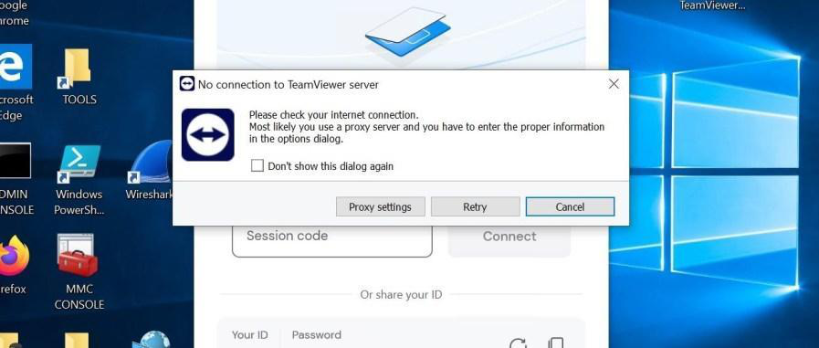

<p><sub><strong>Screenshot 085 - Quarantine Trigger Test:</strong> The workstation repeats the TeamViewer test after the quarantine override is configured.</sub></p>

### Validate the quarantined user

The FortiGate User & Devices dashboard is opened and the resulting banned entry is visible after the repeated TeamViewer test. This screen is the administrative confirmation that the quarantine workflow created a persistent restriction beyond the single blocked browser session.

> The dashboard is also the operational location for reviewing the affected identity or source, expiry, and release action. Quarantine should be investigated rather than treated as a self-explanatory final result, especially when business-critical endpoints are involved.


<p><sub><strong>Screenshot 086 - Quarantine Dashboard:</strong> FortiGate displays the quarantined user or source entry after the Application Control test.</sub></p>

## Testing and Verification

| Control | Validation captured |
|---------|---------------------|
| Administrator RBAC | Restricted menus and read-only IT access |
| LDAP | Successful directory connection and imported users |
| SSL VPN Tunnel Mode | FortiClient connected and RDP desktop reached |
| SSL VPN Web Mode | Portal login, published bookmark, and browser RDP session |
| Destination NAT | IIS validated locally and through the external FortiGate address |
| IPsec | Tunnel status, directional policy configuration, RDP testing, and denied reverse ping |
| SSL/TLS inspection | Full-inspection profile attached to outbound policy |
| Web Filter | Reddit block, authentication prompt, and FortiGate logs |
| DNS Filter | Client block page and DNS-filter logs |
| Antivirus | Safe test sample blocked and logged |
| IPS | Client timeout correlated with a dropped IPS event |
| Application Control | TeamViewer block logs and two-day quarantine workflow |

## Results

The lab demonstrates a layered FortiGate deployment rather than a single firewall rule. Identity controls determine who can administer the device and who can use remote access. Network controls define which paths and services are allowed. Security profiles then inspect permitted traffic and provide client-side and log-based validation.

The project also records the difference between a working laboratory configuration and a production-ready design. Production deployment would require a supported FortiOS release, encrypted LDAP, trusted VPN and inspection certificates, MFA, service separation, and stricter least-privilege firewall rules.

## Skills Demonstrated

- FortiGate firewall administration and directional policy design
- Role-based administrator access and least-privilege validation
- Active Directory LDAP integration for identity-aware policy
- SSL VPN Tunnel Mode, Web Mode, FortiClient, and RDP access
- Destination NAT and controlled internal-service publishing
- Site-to-site IPsec VPN configuration and traffic restriction
- Full SSL/TLS inspection planning and policy attachment
- Web Filter and DNS Filter configuration
- Antivirus and IPS profile deployment and log analysis
- Application identification, blocking, and quarantine response
- End-to-end testing with client behavior and FortiGate security logs

## Repository Structure

```text
FortiGate-Firewall-Configuration/
|-- README.md
|-- LICENSE
|-- IMAGE_MANIFEST.md
|-- docs/
|   `-- notes.md
`-- images/
    |-- 00-source-context/
    |-- 01-fortigate-overview-and-network-topology/
    |-- 02-user-management-and-rbac/
    |-- 03-password-policy/
    |-- 04-ssl-vpn-tunnel-mode-with-ldap-users/
    |-- 05-ssl-vpn-web-mode/
    |-- 06-virtual-ip-and-iis-portal-publishing/
    |-- 07-site-to-site-ipsec-vpn/
    |-- 08-ssl-tls-inspection/
    |-- 09-web-filter/
    |-- 10-dns-filter/
    |-- 11-antivirus-profile/
    |-- 12-ips-profile/
    `-- 13-application-control-and-quarantine/
```

## Notes

- The complete image inventory and global numbering are available in [IMAGE_MANIFEST.md](IMAGE_MANIFEST.md).
- Additional implementation notes are available in [docs/notes.md](docs/notes.md).
