# FortiGate Firewall Security Configuration Lab


> Project by Samuel Kim. All rights reserved. See [LICENSE](LICENSE).

## Overview

This project documents a FortiGate firewall lab focused on secure access, identity-aware policy design, VPN connectivity, internal service publishing, and threat-prevention profiles. The firewall is used as the central enforcement point between WAN, LAN, remote VPN users, and internal services.

The goal is to show how FortiGate features work together in a practical enterprise-style environment: administrator role-based access control, password hardening, LDAP integration, SSL VPN tunnel access, SSL VPN web portal access, Virtual IP publishing, site-to-site IPsec VPN, SSL/TLS inspection, web filtering, DNS filtering, antivirus inspection, intrusion prevention, application control, and quarantine.

From a cybersecurity perspective, the lab focuses on least privilege, controlled remote access, service-restricted firewall policy, encrypted traffic inspection, content filtering, malware prevention, botnet/C&C protection, and validation through client behavior and FortiGate logs.

## Objectives

- Build a FortiGate lab topology with separated WAN and LAN interfaces.
- Configure administrator access using role-based access control.
- Enforce password complexity for administrative accounts.
- Integrate FortiGate with Active Directory through LDAP.
- Configure SSL VPN Tunnel Mode for FortiClient users.
- Configure SSL VPN Web Mode with browser-based RDP access.
- Publish an internal IIS portal through a Virtual IP and inbound firewall policy.
- Build a site-to-site IPsec VPN with service-specific traffic restrictions.
- Apply FortiGate security profiles to outbound traffic.
- Validate blocking, authentication, VPN access, inspection, and logging behavior.

## Project Roadmap

| Section | What I configured |
|---------|-------------------|
| Firewall topology | WAN/LAN placement and internal lab roles |
| Admin access | RBAC profiles, named admins, and password policy |
| Remote access | SSL VPN Tunnel Mode, SSL VPN Web Mode, LDAP users, and RDP access |
| Publishing | Virtual IP and policy for the internal IIS portal |
| Site-to-site VPN | IPsec tunnel with service-specific rules |
| Security profiles | SSL inspection, web filter, DNS filter, AV, IPS, application control, and quarantine |
| Validation | Client tests, block pages, VPN checks, and FortiGate logs |

## Lab Environment

| Component | Description |
|-----------|-------------|
| Firewall | FortiGate VM / FortiOS web interface |
| Lab platform | ENVARIO virtual lab environment |
| Directory services | Windows Server with Active Directory / LDAP, domain `atlas.lab` |
| Client endpoint | Windows 10 workstation |
| Remote access client | FortiClient VPN |
| Internal service | IIS hosted on the internal Windows server |
| WAN interface | `Port1` |
| LAN interface | `Port2` |
| VPN access methods | SSL VPN Tunnel Mode, SSL VPN Web Mode, site-to-site IPsec VPN |

> Lab-specific names, domains, and addresses are kept visible because they are part of the project evidence.

## Tools and Technologies

- FortiGate VM / FortiOS
- FortiClient VPN
- Active Directory and LDAP
- Windows Server
- Windows 10
- IIS
- RDP
- SSL VPN Tunnel Mode
- SSL VPN Web Mode
- IPsec VPN
- Virtual IP / destination NAT
- SSL/TLS inspection
- Web Filter
- DNS Filter
- Antivirus profile
- IPS profile
- Application Control
- FortiGate logging and quarantine

## Implementation Walkthrough

The walkthrough is ordered by dependency. The firewall topology and access model come first, followed by VPN access, service publishing, site-to-site connectivity, and then layered security profiles. Each step explains what was configured, why it matters, and which screenshot validates the configuration or result.

---------

## Firewall Topology and Lab Planning

FortiGate is positioned between the external WAN and the internal LAN. In this lab, `Port1` represents the WAN-facing side and `Port2` represents the LAN-facing side. Internal systems include a Windows client and an AtlasAD domain server.

**Implemented controls:**

- Defined the FortiGate placement between WAN and LAN.
- Identified internal servers and client systems behind the firewall.
- Established the traffic path used later for VPN, VIP, and outbound inspection policies.

### Map the firewall traffic path

The topology shows the client, server, switch, FortiGate firewall, WAN interface, LAN interface, and internet path. This is the baseline for understanding all later policies.

> Firewall rules are meaningful only when the network direction is clear. In a real environment, a wrong WAN/LAN assumption can accidentally expose internal services or block legitimate traffic. This step defines the trust boundary before any access or inspection policy is created.


<p><sub><strong>Screenshot:</strong> FortiGate placed between the internal LAN and external internet path.</sub></p>

### Identify lab networks and internal roles

The lab overview shows the FortiGate VM connected to the lab environment, with internal network ranges used for the Windows workstation and AtlasAD server.

> A firewall project needs a clear role plan. The firewall enforces traffic, the domain server provides identity services, and the client endpoint is used to validate user access and security controls. This context matters because later VPN, LDAP, RDP, and filtering tests all depend on knowing which device is the identity provider, which device is protected, and which device represents the user.

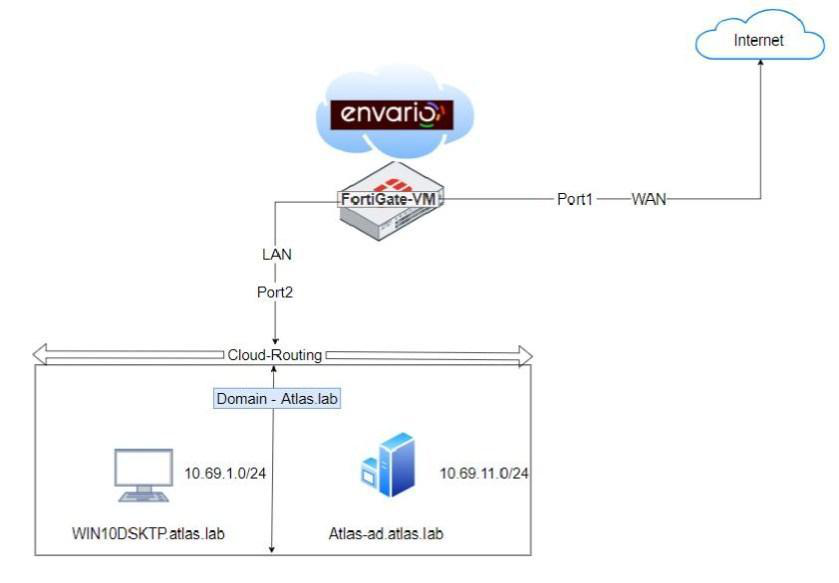

<p><sub><strong>Screenshot:</strong> FortiGate VM, WAN path, and internal lab networks used for the project.</sub></p>

---------

## Administrator Access and RBAC

FortiGate administrator access is configured using custom admin profiles and named administrator accounts. RBAC, or role-based access control, limits what each administrator can see or change.

**Implemented controls:**

- Created a restricted administrator profile.
- Created a dedicated administrator user.
- Created IT administrator users with reduced access.
- Validated the restricted view after login.

### Create a restricted administrator profile

A custom administrator profile is created with selected permissions. Some areas remain writable, while other areas are restricted or read-only.

> Admin profiles reduce the risk of giving every administrator full control. Least privilege means each administrator should receive only the permissions needed for their role. This limits damage if an admin account is misused, compromised, or assigned to a junior operator who only needs monitoring or read-only access.


<p><sub><strong>Screenshot:</strong> Custom FortiGate administrator profile with selected access permissions.</sub></p>

### Create a named administrator account

A dedicated administrator account is created and assigned to the custom profile instead of relying only on a default full-access administrator.

> Named admin accounts improve accountability. When changes are tied to a specific account, it is easier to review activity and investigate configuration mistakes. In a security review, this is much stronger than shared administrator usage because logs can show who changed firewall policy, VPN settings, or security profiles.


<p><sub><strong>Screenshot:</strong> Named administrator account assigned to the custom admin profile.</sub></p>

### Validate restricted IT administrator access

The IT administrator account logs in with a reduced interface view, showing only the sections allowed by the assigned profile.

> RBAC should always be validated from the user's perspective. A restricted login proves that the profile is not only created, but actually limits access in the FortiGate interface. This is important because permission errors are often discovered only after testing the real user experience, not by looking at the profile settings alone.

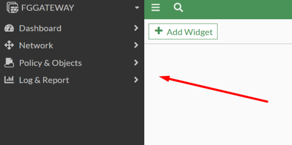

<p><sub><strong>Screenshot:</strong> Reduced FortiGate menu visible after logging in as a restricted IT administrator.</sub></p>

---------

## Password Policy Hardening

The FortiGate password policy is configured to require stronger administrative passwords. The policy includes minimum length and character-composition requirements.

**Implemented controls:**

- Required a minimum password length.
- Required uppercase, lowercase, numeric, and special characters.
- Reduced exposure to weak administrative passwords.

### Enforce administrator password complexity

The password policy requires a stronger password format for administrator accounts.

> Administrative accounts are high-value targets because they can change firewall rules, VPN access, NAT objects, and security profiles. Password complexity does not replace MFA or monitoring, but it reduces the chance of simple password guessing and weak credential reuse. This is a baseline hardening control before deeper access controls are added.


<p><sub><strong>Screenshot:</strong> FortiGate password policy enforcing length and complexity requirements.</sub></p>

---------

## LDAP and SSL VPN Tunnel Mode

FortiGate is integrated with Active Directory through LDAP and then used to provide SSL VPN Tunnel Mode access. Tunnel Mode creates an encrypted VPN tunnel through FortiClient, allowing authenticated users to reach internal resources such as RDP without exposing those internal services directly to the internet.

This section is about secure remote access. The firewall uses directory identity to decide who is allowed in, then uses VPN and firewall policy to control which internal resource the user can reach.

**Implemented controls:**

- Prepared LDAP users and groups in Active Directory.
- Connected FortiGate to the LDAP server.
- Imported remote LDAP users into FortiGate.
- Configured SSL VPN Tunnel Mode with split tunneling.
- Created an RDP access policy for VPN users.
- Validated FortiClient VPN access and internal workstation access.

### Prepare LDAP users in Active Directory

LDAP users are created in Active Directory and organized into a group that FortiGate can later reference.

> LDAP integration allows FortiGate to use centralized identities instead of local-only firewall users. This is closer to enterprise access control because user lifecycle and group membership remain in Active Directory. It also reduces account sprawl: when a user leaves the organization or changes department, access can be managed from the directory instead of separately on the firewall.


<p><sub><strong>Screenshot:</strong> Active Directory LDAP users prepared for FortiGate remote access.</sub></p>

### Connect FortiGate to the LDAP server

FortiGate is configured with the LDAP server IP address, bind account, and directory information required to query Active Directory users.

> The firewall must be able to verify user credentials and group membership before allowing VPN access. A successful LDAP connection is the foundation for identity-based VPN policy. Without this link, FortiGate cannot reliably distinguish approved remote users from local firewall accounts or unauthorized users.


<p><sub><strong>Screenshot:</strong> FortiGate LDAP server object connected successfully to the AtlasAD server.</sub></p>

### Import remote LDAP users

Remote LDAP users are selected from the directory and added to FortiGate user definitions.

> Importing LDAP users makes them available for FortiGate authentication and policy mapping. This step connects the identity source to the firewall access-control workflow. It also makes the later VPN policy more precise because access can be assigned to known users and groups instead of broad network ranges.

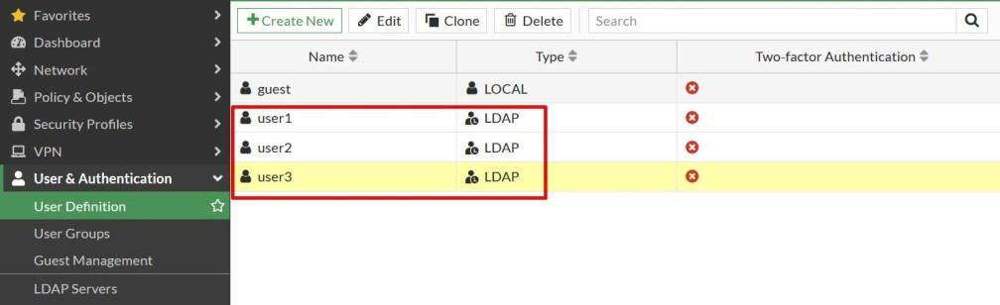

<p><sub><strong>Screenshot:</strong> LDAP users imported into FortiGate user definitions.</sub></p>

### Configure the SSL VPN tunnel portal

The SSL VPN tunnel portal defines split tunneling, the protected internal destination, and the VPN address pool assigned to remote clients.

> The portal controls what VPN users receive after authentication. Split tunneling limits which traffic goes through the VPN, while the address pool gives VPN clients an internal tunnel address. This improves security and usability because only required internal traffic is sent through the tunnel instead of forcing all user traffic through the firewall.


<p><sub><strong>Screenshot:</strong> SSL VPN tunnel portal configured with split tunneling and internal destination settings.</sub></p>

### Map LDAP users to SSL VPN access

The SSL VPN settings map the LDAP user group to the tunnel portal.

> Authentication mapping decides which users receive which VPN portal. Without this mapping, users may authenticate successfully but still not receive the intended access profile. This step is where identity becomes authorization: the firewall decides not only who the user is, but what VPN experience and access level they should receive.

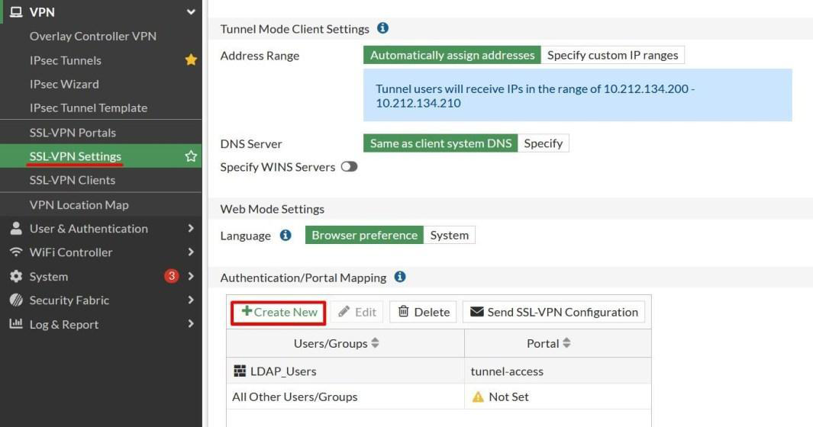

<p><sub><strong>Screenshot:</strong> LDAP users mapped to the SSL VPN tunnel portal.</sub></p>

### Allow RDP from VPN users to the internal workstation

A firewall policy allows SSL VPN tunnel users to reach the internal Windows workstation using RDP.

> VPN authentication alone does not automatically allow traffic. A firewall policy is still required to define the source, destination, service, schedule, and action. This prevents the VPN from becoming a broad internal network bridge and keeps access limited to the required RDP destination.

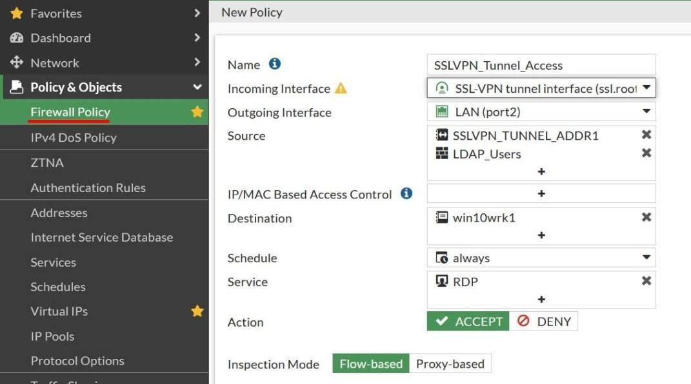

<p><sub><strong>Screenshot:</strong> Firewall policy allowing SSL VPN users to access the internal workstation with RDP.</sub></p>

### Validate FortiClient VPN and internal access

The FortiClient session connects successfully, and the internal Windows workstation is reachable after the tunnel is established.

> Validation proves the complete path works: LDAP authentication, VPN portal mapping, address assignment, firewall policy, and internal resource access. This is the security proof for the whole remote-access chain, showing that users can connect securely while still being limited by firewall policy.


<p><sub><strong>Screenshot:</strong> FortiClient VPN session connected with an assigned tunnel address.</sub></p>

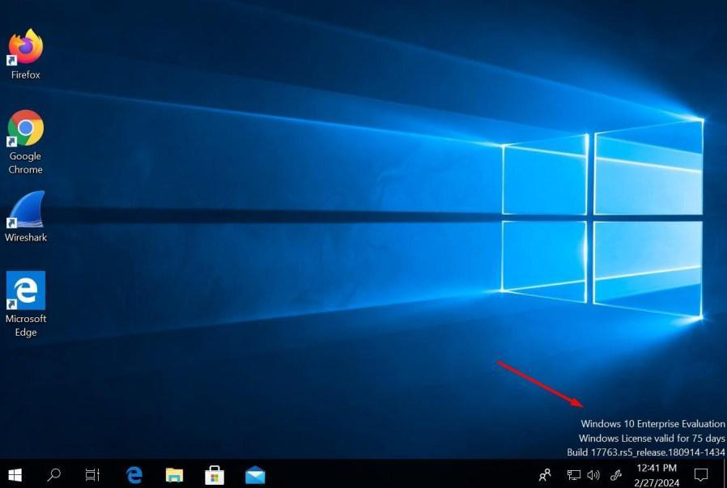

<p><sub><strong>Screenshot:</strong> Internal Windows workstation reached after SSL VPN connection.</sub></p>

---------

## SSL VPN Web Mode

SSL VPN Web Mode provides access to internal resources through a browser portal. In this lab, LDAP users access an internal Windows workstation through an RDP bookmark instead of using a full FortiClient tunnel.

This mode is useful when users need a specific internal application or remote desktop session but should not receive broader network-level VPN access.

**Implemented controls:**

- Created LDAP users for the web access scenario.
- Configured an SSL VPN web portal.
- Created an RDP bookmark.
- Mapped LDAP users to the portal.
- Created a firewall policy for Web Mode access.
- Validated browser-based login and RDP access.

### Configure the SSL VPN web portal

The web portal is created and configured for browser-based access.

> Web Mode is useful when users need access to specific internal resources without creating a full network tunnel. It reduces the amount of network exposure compared with broad tunnel access. This is safer for limited-use remote access because users interact with published resources instead of receiving direct routed access to the internal LAN.


<p><sub><strong>Screenshot:</strong> SSL VPN web portal created for browser-based remote access.</sub></p>

### Create an RDP bookmark

An RDP bookmark is added to the web portal so users can launch a remote desktop session from the SSL VPN portal.

> Bookmarks define which internal resource the user can access. This keeps access focused on a specific service instead of exposing the whole LAN. In this case, the user receives access to an RDP target through the portal, which is more controlled than opening general internal connectivity.


<p><sub><strong>Screenshot:</strong> RDP bookmark configured for the internal Windows workstation.</sub></p>

### Map LDAP users and create the access policy

The LDAP group is mapped to the web portal, and a firewall policy allows the portal traffic toward the internal workstation.

> Web portal access still depends on both identity mapping and firewall policy. The user must be allowed by authentication and by traffic policy. This layered control is important because a valid login should not automatically mean access to every internal system.


<p><sub><strong>Screenshot:</strong> Firewall policy allowing SSL VPN Web Mode users to reach the internal workstation.</sub></p>

### Validate browser-based RDP access

The user logs into the SSL VPN web portal and launches the RDP bookmark.

> This confirms that Web Mode is usable from the user's perspective and that the bookmark reaches the intended internal system. It validates the full browser-based workflow: LDAP login, portal mapping, bookmark availability, and controlled RDP access.


<p><sub><strong>Screenshot:</strong> LDAP user login to the SSL VPN web portal.</sub></p>

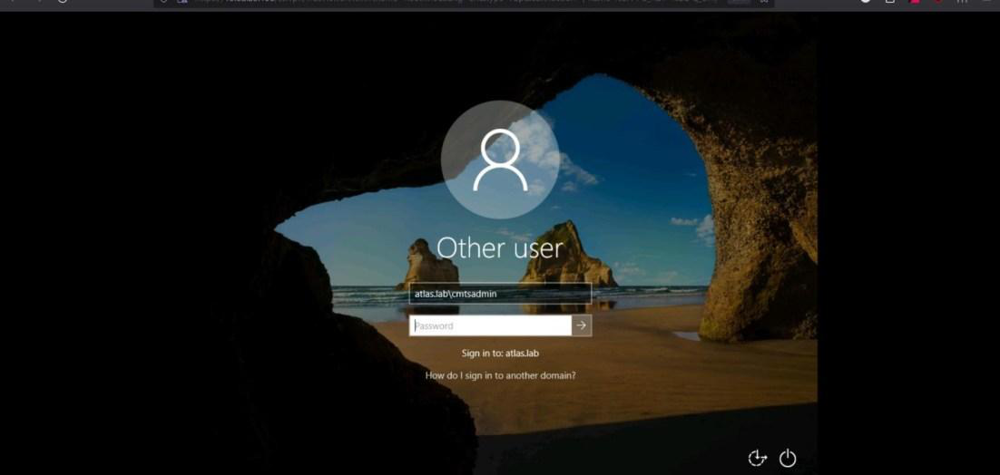

<p><sub><strong>Screenshot:</strong> Browser-based RDP access launched from the SSL VPN portal.</sub></p>

---------

## Virtual IP and IIS Portal Publishing

An internal IIS web portal is published through FortiGate using a Virtual IP. A Virtual IP is FortiGate's destination NAT object: it maps traffic arriving on an external address or interface to an internal server.

This section demonstrates controlled service publishing. The internal IIS server remains behind the firewall, while FortiGate decides which external traffic is translated and allowed.

**Implemented controls:**

- Installed and tested IIS on the internal server.
- Created a Virtual IP object for the internal web server.
- Created an inbound WAN-to-LAN firewall policy.
- Validated external access to the IIS portal.

### Install and validate IIS internally

IIS is installed on the internal Windows server, and the default web page is tested locally.

> The internal service must work before publishing it through the firewall. If the service fails locally, NAT and firewall policy troubleshooting becomes misleading. Testing IIS internally separates server-side problems from firewall-side problems.


<p><sub><strong>Screenshot:</strong> IIS web server role selected on the internal Windows server.</sub></p>

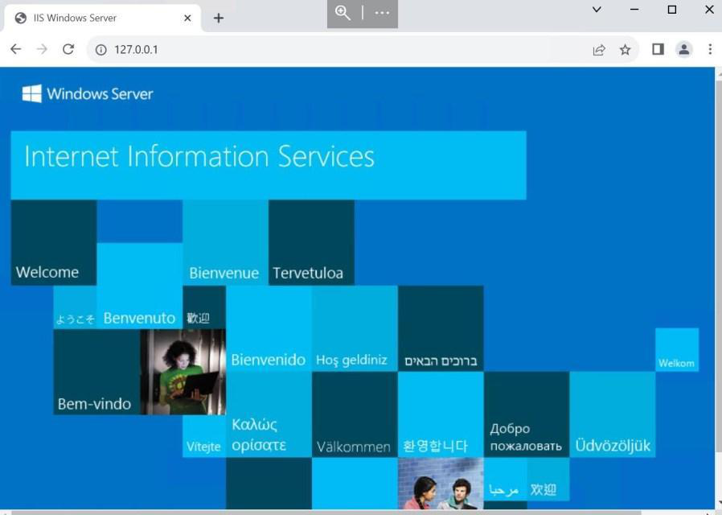

<p><sub><strong>Screenshot:</strong> IIS default page accessible locally before firewall publishing.</sub></p>

### Create the Virtual IP object

The Virtual IP object maps external web traffic to the internal IIS server.

> VIP configuration separates address translation from policy. The VIP defines where traffic is translated, while the firewall policy decides whether the traffic is allowed. This keeps publishing controlled because translation alone does not automatically permit access.

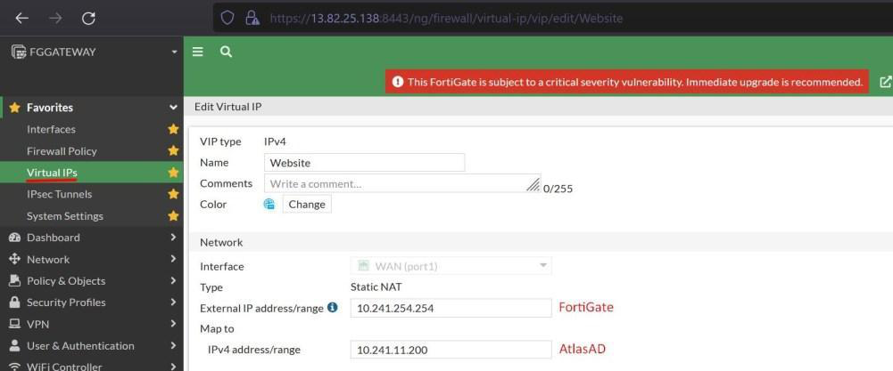

<p><sub><strong>Screenshot:</strong> Virtual IP object mapping external access to the internal IIS server.</sub></p>

### Allow inbound web access

A firewall policy allows WAN traffic to reach the internal website through the VIP.

> NAT alone does not allow access. The firewall policy must explicitly permit the inbound service, which keeps service publishing controlled. This is important for security because only the required web service should be exposed, not the entire internal server.

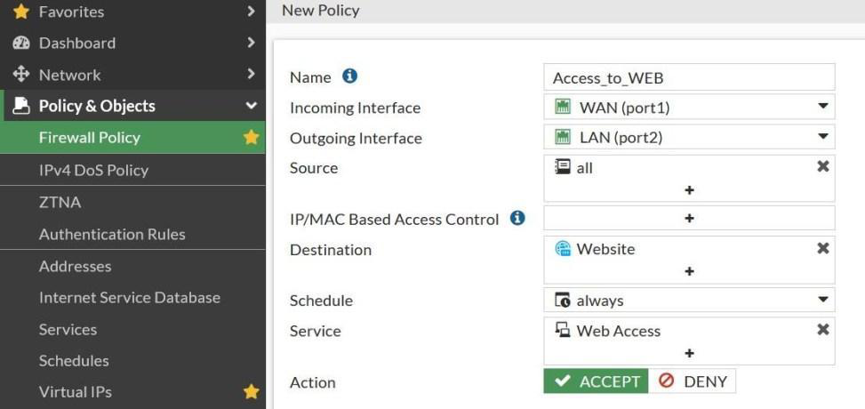

<p><sub><strong>Screenshot:</strong> WAN-to-LAN firewall policy allowing web access through the Virtual IP.</sub></p>

### Validate external portal access

The IIS portal is accessed from the external side through FortiGate.

> External validation proves that VIP translation, firewall policy, and the internal web service all work together. It also confirms the user-facing result: the service is reachable from the intended side of the firewall without giving direct access to the internal network.


<p><sub><strong>Screenshot:</strong> IIS portal reachable externally through FortiGate publishing.</sub></p>

---------

## Site-to-Site IPsec VPN

A site-to-site IPsec VPN is built between two FortiGate environments representing New York and Tel Aviv. IPsec creates an encrypted tunnel between sites, allowing selected private networks to communicate securely over an untrusted path.

This section is not only about making the tunnel work. It also demonstrates that site-to-site connectivity should be restricted by direction and service, so connected networks do not automatically become fully trusted.

**Implemented controls:**

- Created an IPsec tunnel between two FortiGate firewalls.
- Defined local and remote protected networks.
- Restricted traffic by direction and service.
- Validated tunnel status and service behavior.

### Build the IPsec tunnel

The IPsec tunnel wizard is used to define the tunnel peers, protected networks, and authentication settings.

> Site-to-site VPNs are used to connect branch networks securely. Correct peer and network definitions are required so each firewall knows which traffic should enter the encrypted tunnel. This protects private traffic across an untrusted transport while keeping encryption scoped to the intended networks.

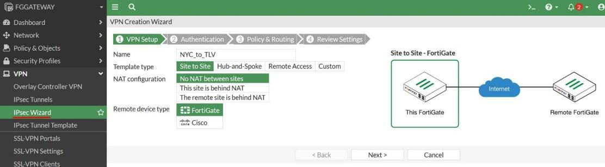

<p><sub><strong>Screenshot:</strong> IPsec tunnel wizard used to create the site-to-site VPN.</sub></p>

### Confirm VPN status and protected networks

The VPN monitor shows the tunnel and the protected network objects used by the VPN.

> Tunnel status confirms the VPN is negotiated, while protected networks define which subnets are allowed to use the encrypted path. This matters because a tunnel can appear configured but still fail if phase negotiation, routing, or protected subnet definitions are wrong.


<p><sub><strong>Screenshot:</strong> IPsec VPN tunnel visible in FortiGate VPN monitoring.</sub></p>

### Restrict traffic by service

Firewall policies restrict cross-site traffic so one direction allows ICMP and the other direction allows RDP.

> A VPN should not automatically mean full trust between sites. Service-specific policy reduces exposure by allowing only the traffic that is required. This follows least privilege at the network layer: ICMP and RDP are allowed only where the lab requirement says they should be allowed.

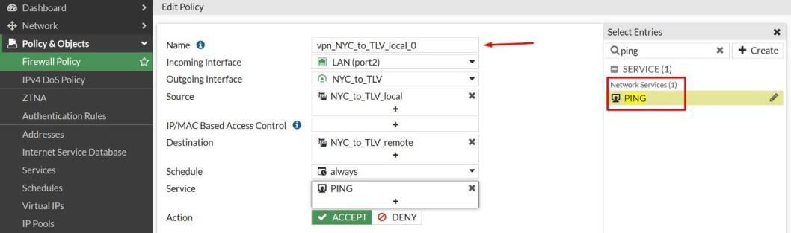

<p><sub><strong>Screenshot:</strong> Site-to-site VPN policy allowing ICMP traffic in the intended direction.</sub></p>


<p><sub><strong>Screenshot:</strong> Site-to-site VPN policy allowing RDP traffic in the intended direction.</sub></p>

### Validate allowed and blocked behavior

Connectivity tests show which traffic is allowed and which traffic is blocked by policy.

> Security validation should test both permitted and denied behavior. A working tunnel is not enough; the service restrictions must also behave as designed. The blocked test is as important as the successful test because it proves the VPN is controlled, not wide open.

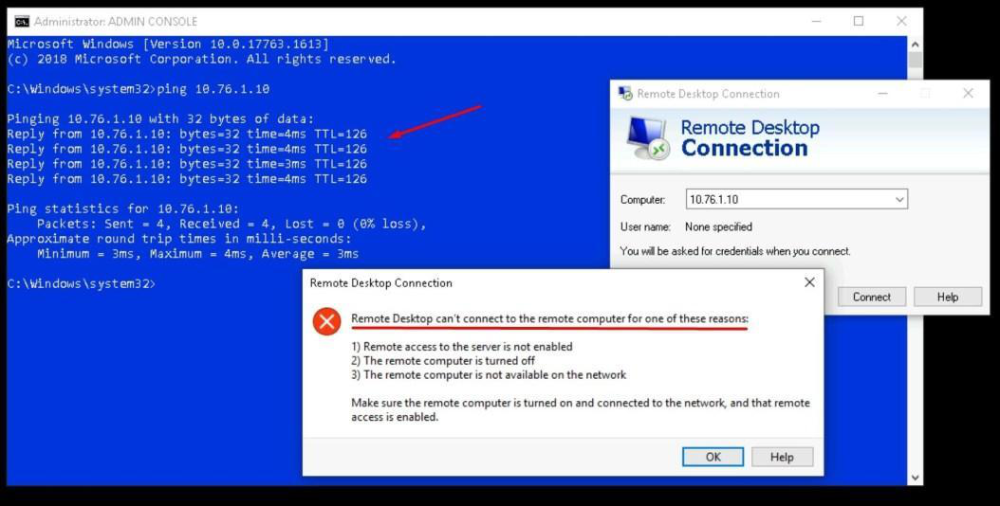

<p><sub><strong>Screenshot:</strong> Cross-site traffic validation for the IPsec VPN policy behavior.</sub></p>

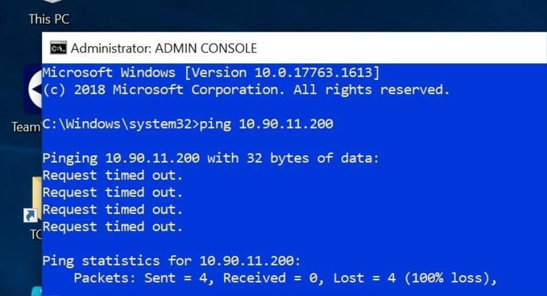

<p><sub><strong>Screenshot:</strong> Ping denied in the direction where ICMP was not allowed.</sub></p>

---------

## SSL/TLS Inspection

An SSL/TLS inspection profile is created and applied to outbound traffic. SSL/TLS inspection allows FortiGate to inspect encrypted traffic that would otherwise hide web filtering, antivirus, IPS, or application-control matches.

This is important because most modern web traffic is encrypted. Without inspection, a firewall may allow HTTPS sessions while having limited visibility into the files, URLs, or applications inside those sessions.

**Implemented controls:**

- Created a full SSL inspection profile.
- Applied the profile to outbound traffic.
- Improved inspection coverage for encrypted sessions.

### Create the SSL/TLS inspection profile

The profile is configured for full SSL inspection behavior.

> Many modern threats and policy violations travel over HTTPS. Without SSL/TLS inspection, the firewall may only see the destination and not enough content to apply deeper security controls. This step prepares the firewall to enforce web, antivirus, IPS, and application policies against encrypted sessions instead of only clear-text traffic.

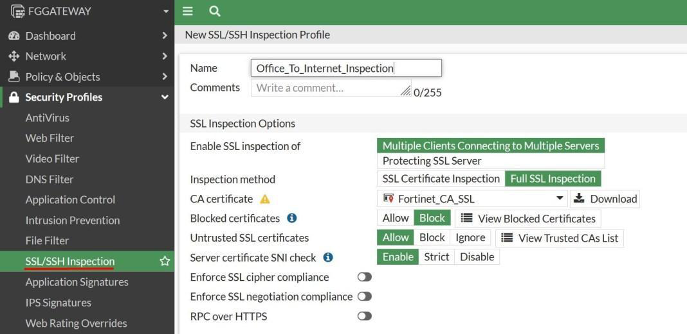

<p><sub><strong>Screenshot:</strong> Full SSL/TLS inspection profile created for outbound inspection.</sub></p>

### Apply inspection to outbound policy

The SSL/TLS inspection profile is attached to the outbound traffic policy.

> A profile does nothing until it is applied to traffic. Attaching it to the policy makes inspection active for matching sessions. This is a common firewall concept: objects and profiles define behavior, but policy attachment decides where that behavior is enforced.


<p><sub><strong>Screenshot:</strong> SSL/TLS inspection profile applied to the outbound firewall policy.</sub></p>

> Production note: Full SSL inspection requires careful certificate deployment, privacy review, and application compatibility testing.

---------

## Web Filtering

A proxy-based web filter profile is created to block selected URLs and require authentication for selected web categories. The profile is then applied to outbound traffic.

This section demonstrates user-facing web security. The goal is to control risky or non-business browsing while still allowing access when policy requires authentication rather than a full block.

**Implemented controls:**

- Created a proxy-based web filter profile.
- Blocked Reddit through a static URL filter entry.
- Required authentication for the Shopping category.
- Applied the profile to outbound traffic.
- Validated blocking, authentication, and logs.

### Create the web filter profile

The `Office_Web_Filter` profile is created in proxy mode.

> Web filtering controls user access to websites based on URLs, categories, and policy actions. Proxy mode provides deeper web-filtering behavior for matching traffic. This helps enforce acceptable-use policy and reduces exposure to risky web destinations.


<p><sub><strong>Screenshot:</strong> Proxy-based web filter profile created for outbound web traffic.</sub></p>

### Block a static URL

A static URL filter entry is created to block Reddit.

> Static URL filtering is useful when a specific site must be blocked regardless of its broader category. This gives administrators direct control over named destinations. It is useful for clear business rules, such as blocking a known site even if category-based filtering would otherwise allow it.


<p><sub><strong>Screenshot:</strong> Static URL filter entry configured to block Reddit.</sub></p>

### Require authentication for a web category

The Shopping category is configured to require authentication.

> Category authentication allows access to be tied to user identity. This is stronger than anonymous allow/block behavior because the firewall can require a known user before allowing the category. It also makes web activity more accountable because access decisions are connected to user authentication.


<p><sub><strong>Screenshot:</strong> Shopping category configured with authentication requirement.</sub></p>

### Apply the web filter to outbound traffic

The profile is attached to the outbound firewall policy.

> Security profiles only affect traffic when they are attached to matching policies. This step activates the web filter for LAN-to-WAN sessions. Without this attachment, the profile would exist in FortiGate but would not protect users browsing from the internal network.


<p><sub><strong>Screenshot:</strong> Web filter profile applied to the outbound firewall policy.</sub></p>

### Validate web blocking and authentication

Client tests show a blocked Reddit page and an authentication challenge for restricted category access.

> Client-side validation proves the policy affects real browsing behavior, and logs confirm the firewall recorded the enforcement action. This gives both user-facing proof and administrator-facing evidence for auditing and troubleshooting.

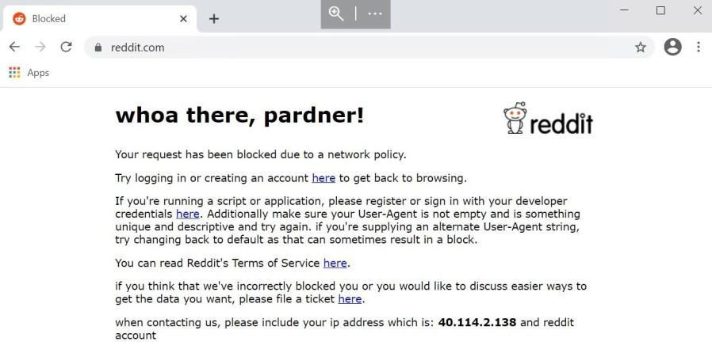

<p><sub><strong>Screenshot:</strong> Reddit access blocked by the FortiGate web filter.</sub></p>


<p><sub><strong>Screenshot:</strong> FortiGate web filter logs showing blocked and controlled web traffic.</sub></p>

---------

## DNS Filtering

A DNS filter profile is configured to block botnet and command-and-control domains and to demonstrate domain-level blocking with a controlled domain entry.

DNS filtering works earlier in the connection process than web or file inspection. By blocking malicious or unwanted domains during name resolution, the firewall can stop users or malware before a full session is established.

**Implemented controls:**

- Enabled botnet and C&C domain blocking.
- Created a static domain filter entry.
- Applied the DNS filter profile to outbound traffic.
- Validated block behavior and DNS logs.

### Enable botnet and C&C domain protection

The DNS filter profile is configured to block DNS requests associated with botnet or command-and-control activity.

> Malware often relies on DNS to locate command servers. Blocking known malicious DNS destinations can stop malware communication before a direct connection is made. This is especially useful against botnets and C&C infrastructure because it can interrupt the lookup stage of the attack chain.


<p><sub><strong>Screenshot:</strong> DNS filter profile configured with botnet and C&C domain protection.</sub></p>

### Create a controlled domain filter entry

A wildcard entry is created for a test domain and redirected to the block portal.

> Static domain filters allow administrators to block specific domains. Wildcards can cover subdomains, but they must be used carefully to avoid overblocking. This lab uses a controlled domain entry to show how policy can block a domain family without relying only on FortiGuard categories.

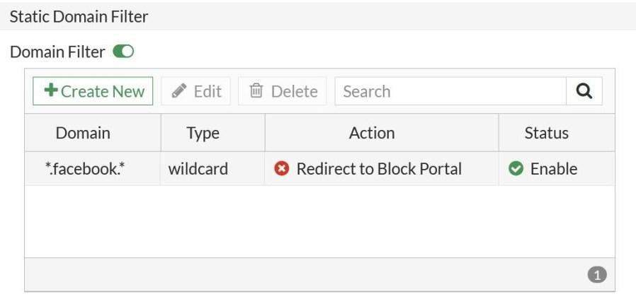

<p><sub><strong>Screenshot:</strong> Static DNS domain filter entry configured with a block action.</sub></p>

### Apply the DNS filter to outbound policy

The DNS filter profile is attached to the outbound firewall policy.

> The filter must be attached to traffic policy before it can inspect and block client DNS behavior. This connects the DNS security profile to the actual LAN-to-WAN traffic path used by the client.

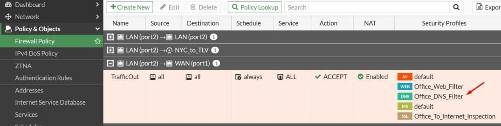

<p><sub><strong>Screenshot:</strong> DNS filter profile applied to the outbound firewall policy.</sub></p>

### Validate DNS block behavior

The client receives a blocked page, and FortiGate logs record the DNS filtering event.

> Validation confirms that the DNS control is active and that the firewall is logging the enforcement action for review. This matters because DNS blocks can be silent to users unless logs and block pages are reviewed.


<p><sub><strong>Screenshot:</strong> Client blocked by DNS filter policy.</sub></p>

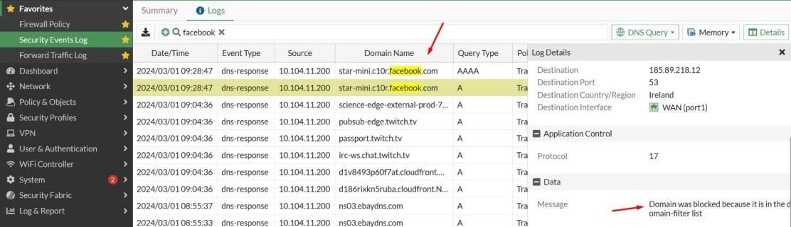

<p><sub><strong>Screenshot:</strong> FortiGate DNS logs showing blocked domain activity.</sub></p>

---------

## Antivirus Inspection

An antivirus profile is created and applied to outbound traffic. The profile is tested by attempting to download known malicious or test files, then reviewing FortiGate detection logs.

This demonstrates gateway malware prevention. The firewall becomes an inspection point before files reach the endpoint, adding another layer before workstation antivirus or EDR.

**Implemented controls:**

- Created a flow-based antivirus profile.
- Enabled scanning for common internet protocols.
- Applied the profile to outbound traffic.
- Blocked malicious test downloads.
- Reviewed detection logs.

### Create the antivirus profile

The `Office_AV_Profile` profile is created with scanning enabled for common protocols.

> Antivirus inspection helps detect and block malicious files before they reach the endpoint. This adds a gateway-level control in front of workstation defenses. In layered security, this reduces the chance that a user downloads malware directly to the internal machine.


<p><sub><strong>Screenshot:</strong> Flow-based antivirus profile created with protocol scanning enabled.</sub></p>

### Apply antivirus inspection to outbound policy

The antivirus profile is attached to the LAN-to-WAN policy.

> Applying the profile to outbound traffic allows FortiGate to inspect file downloads and web traffic that match the policy. This turns the AV profile from a configuration object into an active control on user internet traffic.

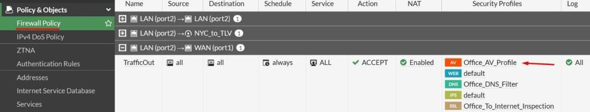

<p><sub><strong>Screenshot:</strong> Antivirus profile attached to the outbound firewall policy.</sub></p>

### Validate malware download blocking

A malicious test download is blocked, and FortiGate logs show the detection.

> The blocked download and log entry prove that the antivirus profile is enforcing policy, not just configured in the interface. This is the evidence that matters in a security project: the threat-like action was attempted, blocked, and logged.

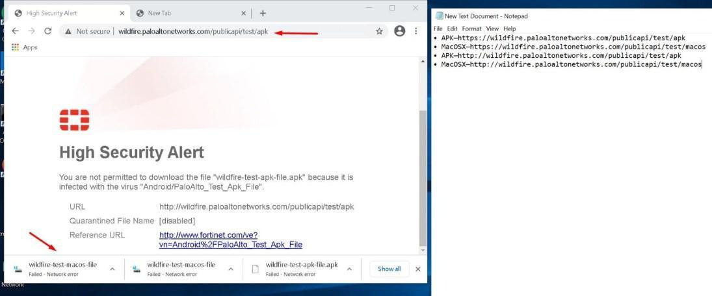

<p><sub><strong>Screenshot:</strong> High security alert shown after the antivirus profile blocks a malicious test download.</sub></p>

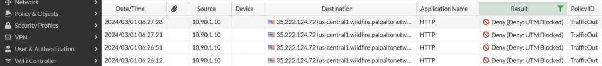

<p><sub><strong>Screenshot:</strong> FortiGate antivirus logs showing blocked malware test activity.</sub></p>

---------

## IPS Protection

An IPS profile is created and applied to outbound traffic. IPS, or Intrusion Prevention System, checks traffic for suspicious patterns and known attack behavior.

This section adds network threat prevention to the outbound policy. While antivirus focuses on malicious files, IPS focuses on exploit patterns, botnet indicators, and suspicious network behavior.

**Implemented controls:**

- Created an IPS sensor.
- Enabled botnet and C&C-related IP blocking.
- Applied the profile to the outbound policy.
- Validated blocked behavior and IPS logs.

### Create the IPS sensor

The `Office_IPS_Profile` sensor is created with botnet C&C protection enabled.

> IPS provides a network-level detection and prevention layer. It can block traffic associated with known exploit patterns, malicious infrastructure, or suspicious behavior. This helps stop attacks that may not appear as simple URL or file-download events.


<p><sub><strong>Screenshot:</strong> IPS sensor created with botnet C&C blocking enabled.</sub></p>

### Apply IPS protection to outbound traffic

The IPS profile is attached to the outbound firewall policy.

> The profile must be attached to matching traffic before it can detect or block suspicious sessions. This ensures the IPS engine actually sees the user traffic that should be inspected.


<p><sub><strong>Screenshot:</strong> IPS profile applied to the outbound firewall policy.</sub></p>

### Validate IPS enforcement

The client traffic times out and FortiGate logs show dropped traffic.

> IPS validation should include both user-visible behavior and firewall-side logs. Together they show that traffic was blocked and recorded. The client timeout shows impact, while the logs explain why the traffic was dropped.


<p><sub><strong>Screenshot:</strong> Client connection timed out after IPS policy enforcement.</sub></p>

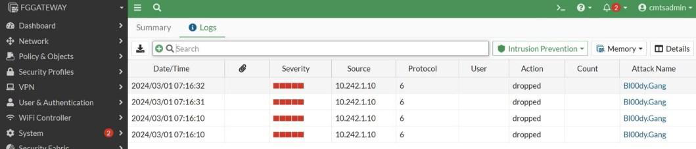

<p><sub><strong>Screenshot:</strong> FortiGate logs showing dropped traffic after IPS enforcement.</sub></p>

---------

## Application Control and Quarantine

Application Control is configured to detect and block remote-access applications such as TeamViewer. The profile is later extended with a quarantine action so matching users can be isolated temporarily.

This section focuses on application-aware security. Instead of only allowing or blocking traffic by port, FortiGate identifies the application behavior and can respond when a risky remote-access tool is detected.

**Implemented controls:**

- Created an application control profile.
- Blocked remote-access application behavior.
- Applied the profile to outbound traffic.
- Configured a two-day quarantine action.
- Validated the quarantine event from the dashboard.

### Create the application control profile

The `Office_Application_Control` profile is created and configured to target remote access applications.

> Application Control works at the application level, not only by port number. This helps block tools that may use common ports or encrypted sessions but still match known application signatures. It is useful for reducing unauthorized remote-control tools, shadow IT software, and applications that bypass simple port-based rules.

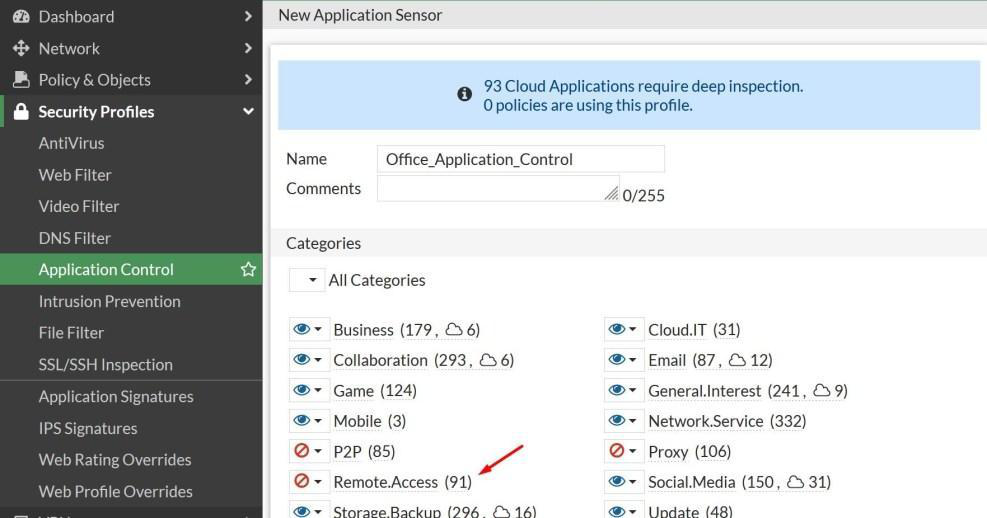

<p><sub><strong>Screenshot:</strong> Application Control profile created with remote-access application category selected.</sub></p>

### Apply Application Control to outbound traffic

The profile is attached to the outbound firewall policy.

> Applying Application Control to the policy turns the profile into an active enforcement point for matching LAN-to-WAN sessions. This makes the outbound firewall policy inspect what users are actually running, not only where they are connecting.

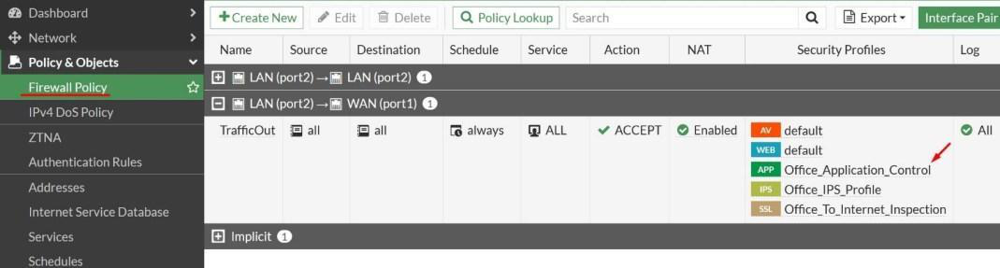

<p><sub><strong>Screenshot:</strong> Application Control profile applied to outbound traffic policy.</sub></p>

### Validate blocked remote-access behavior

The client receives a browser warning or connection failure, and FortiGate logs show blocked application activity.

> Blocking remote-control tools reduces the risk of unauthorized remote access, shadow IT support tools, and command-and-control style remote sessions. The validation step shows the policy from the user side and gives the administrator evidence in FortiGate logs.


<p><sub><strong>Screenshot:</strong> Client-side warning after Application Control blocks unsafe remote-access behavior.</sub></p>

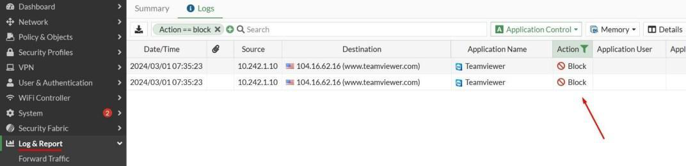

<p><sub><strong>Screenshot:</strong> FortiGate logs showing blocked TeamViewer application activity.</sub></p>

### Configure quarantine for matching application activity

The profile is configured to quarantine users for two days when matching TeamViewer behavior is detected.

> Quarantine is a stronger response than blocking a single session. It temporarily isolates the user or device so administrators can investigate repeated or risky behavior. This is useful when a single blocked event may indicate a compromised host, policy violation, or unauthorized remote-support tool.

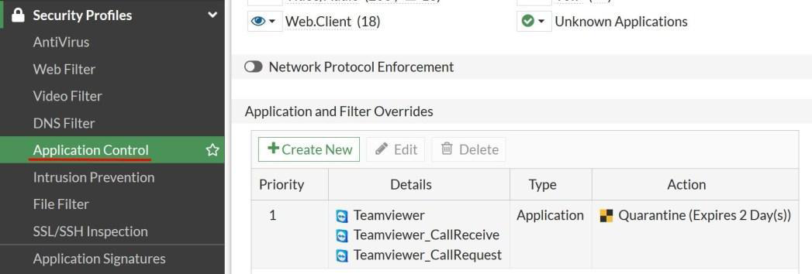

<p><sub><strong>Screenshot:</strong> Application Control override configured to quarantine TeamViewer activity for two days.</sub></p>

### Validate user quarantine

The FortiGate dashboard shows the quarantined user after the policy match.

> Dashboard validation confirms that the response action was triggered and visible to administrators for follow-up. This closes the enforcement loop: FortiGate detects the application, blocks or quarantines the user, and gives the security team a visible event to investigate.


<p><sub><strong>Screenshot:</strong> FortiGate quarantine dashboard showing the affected user.</sub></p>

## Testing and Verification

| Feature | Validation Method | Result |
|---------|-------------------|--------|
| Administrator RBAC | Login with restricted administrator accounts | Restricted menu and permissions were confirmed |
| Password policy | Review FortiGate password policy settings | Complexity requirements were enforced |
| LDAP integration | FortiGate LDAP connection and imported users | LDAP users were available for VPN access |
| SSL VPN Tunnel Mode | FortiClient login and internal workstation access | VPN connection and internal access worked |
| SSL VPN Web Mode | Browser portal login and RDP bookmark launch | Browser-based remote access worked |
| Virtual IP publishing | External access to IIS portal | Internal web service was reachable through FortiGate |
| Site-to-site IPsec VPN | ICMP/RDP traffic tests across sites | Directional service restrictions were validated |
| SSL/TLS inspection | Profile applied to outbound policy | Encrypted traffic became eligible for deeper inspection |
| Web filtering | Blocked URL, authentication challenge, and logs | Web control behavior was confirmed |
| DNS filtering | Block page and DNS logs | Domain-level block behavior was confirmed |
| Antivirus | Malicious test download and logs | Download was blocked and logged |
| IPS | Client timeout and dropped logs | Suspicious destination traffic was blocked |
| Application control | TeamViewer block and quarantine dashboard | Application blocking and quarantine were demonstrated |

## Results

The lab produced a working FortiGate security configuration with identity-aware administration, LDAP-backed remote access, SSL VPN Tunnel Mode, SSL VPN Web Mode, inbound service publishing, site-to-site IPsec connectivity, and multiple layered security profiles applied to outbound traffic.

The project demonstrates how FortiGate policies and security profiles work together: firewall policies define who can talk to what, while inspection profiles enforce web, DNS, malware, intrusion-prevention, and application-control decisions on matching traffic.

## Skills Demonstrated

- FortiGate firewall administration
- Network segmentation and policy direction
- Role-based administrator access control
- Password policy hardening
- Active Directory and LDAP integration
- SSL VPN Tunnel Mode configuration
- SSL VPN Web Mode configuration
- RDP access control over VPN
- Virtual IP / destination NAT publishing
- Site-to-site IPsec VPN configuration
- Service-restricted firewall policy design
- SSL/TLS inspection profile configuration
- Web filtering and DNS filtering
- Antivirus and IPS profile enforcement
- Application Control and user quarantine
- Security validation through client behavior and FortiGate logs

## Repository Structure

```text
FortiGate-Firewall-Configuration-main/
|-- README.md
|-- LICENSE
|-- IMAGE_MANIFEST.md
|-- docs/
|   `-- notes.md
`-- images/
    |-- 01-fortigate-overview-and-network-topology/
    |-- 02-user-management-and-rbac/
    |-- 03-password-policy/
    |-- 04-ssl-vpn-tunnel-mode-with-ldap-users/
    |-- 05-ssl-vpn-web-mode/
    |-- 06-virtual-ip-and-iis-portal-publishing/
    |-- 07-site-to-site-ipsec-vpn/
    |-- 08-ssl-tls-inspection/
    |-- 09-web-filter/
    |-- 10-dns-filter/
    |-- 11-antivirus-profile/
    |-- 12-ips-profile/
    `-- 13-application-control-and-quarantine/
```

## Notes

- The lab is documentation-focused and does not include live FortiGate configuration exports.
- Screenshots are organized by chapter and kept as local repository assets.
- Additional production and technical notes are documented in [docs/notes.md](docs/notes.md).
- Production deployments should review SSL inspection certificates, privacy requirements, exposed services, VPN authentication, logging retention, and administrator privilege design before applying similar controls.
